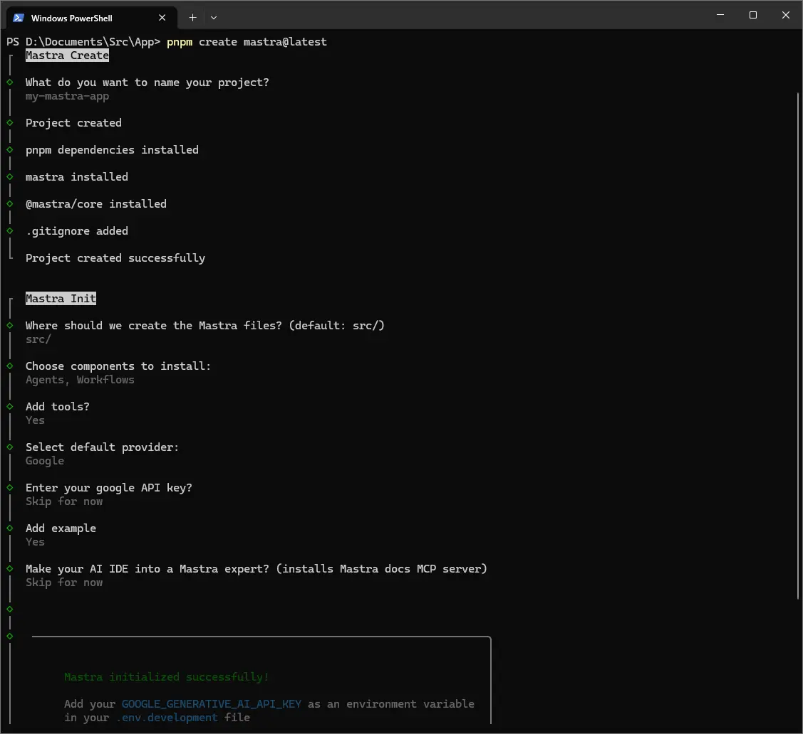
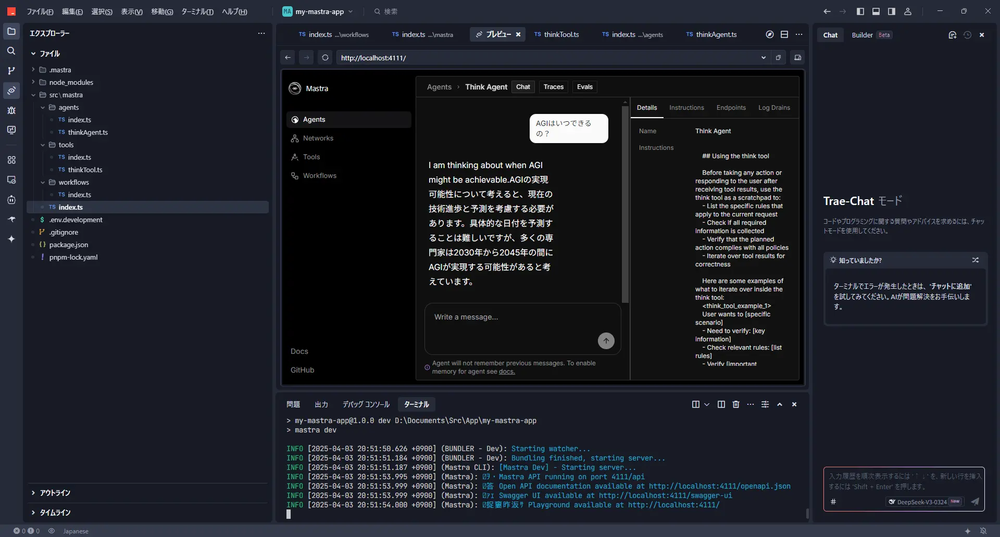
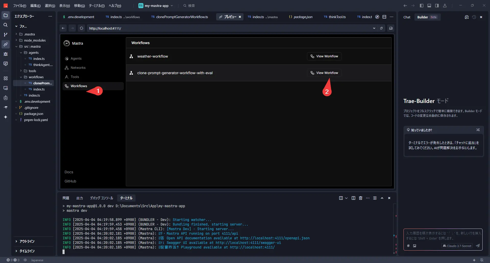

こんにちは！今回は、mastraっていうライブラリを使って、Grok-2とGemini 2.5 Pro expなどのLLMを動かしてみたお話です。

mastraは、プロンプトを使うLLMを決めて「AIエージェント」を作って、それらをどういう順番で動かすかの「ワークフロー」を組めるライブラリです。TypeScriptで書けるっていうのが個人的には嬉しいポイントで、これならCloudflare WorkersとかDenoみたいな環境で、安価にWebサービスに組み込めるかもしれないなと思ってます。

似たようなライブラリだとLangChainとか有名ですけど、mastraはデプロイのしやすさでちょっと有利かもしれませんね。あと、以前試したDifyっていうツールが、繰り返し処理（ループ）が少し苦手な感じだったので、mastraならどうかな？と思って試してみた、という背景もあります。

では、さっそく試していきましょう！

## mastraのインストール

今回はWindows 11で、AIエディターの「Trae」と、高速なパッケージマネージャー「pnpm」を使ってみます。

まずは、mastraの公式サイトにある手順でプロジェクトを作っていきます。
（参考: [Create a New Project](https://mastra.ai/docs/getting-started/installation#create-a-new-project)）

ターミナルを開いて、次のコマンドを実行します。

```batch
pnpm create mastra@latest
```

いくつか質問されるので、答えていきましょう。



プロジェクト名を聞かれます。今回は`my-mastra-app`にしました。
```batch
◇  What do you want to name your project?
│  my-mastra-app
```

ソースファイルを置く場所ですね。デフォルトの`src/`でOKです。
```batch
◆  Where should we create the Mastra files? (default: src/)
│  src/
```

必要なコンポーネントを選びます。Agents（エージェント）、Workflows（ワークフロー）とTools（ツール）は後で使うので、Yesを選んでおきましょう。
```batch
◆  Choose components to install:
│  ◼ Agents
│  ◼ Workflows
◇  Add tools?
│  Yes
```

デフォルトで使うLLMプロバイダーを選びます。今回はGoogleを選んでみましたが、これは後で自由に変更できます。
```batch
◇  Select default provider:
│  Google
```

APIキーの設定です。あとで`.env.development`ファイルに設定するので、ここではスキップ（Skip for now）で大丈夫です。
```batch
◆  Enter your google API key?
│  ● Skip for now (default)
```

サンプルの追加は、今回はYesにします。
```batch
◇  Add example
│  Yes
```

AI IDEとの連携も、今回はスキップしました。
```batch
◇  Make your AI IDE into a Mastra expert? (installs Mastra docs MCP server)
│  Skip for now
```

これでプロジェクトの雛形ができました！
作成されたプロジェクトのフォルダに移動して、必要なライブラリをインストールします。

```batch
cd my-mastra-app
pnpm i
```

開発用のサーバーを起動してみましょう。Ctrl+Cで止められます。

```batch
pnpm run dev
```

## 設定を見てみよう

インストールが終わったら、いくつかファイルを見てみましょうか。

`package.json`を見ると、`dependencies`に`@ai-sdk/google`が入ってますね。これはVercel社が提供しているライブラリで、GeminiだけじゃなくてDeepSeekやGrok、OpenRouterみたいな他のLLMプロバイダーにも対応しているみたいです。便利そうですね！
（参考: [AI SDK Providers](https://sdk.vercel.ai/providers/ai-sdk-providers)）

`scripts`には`dev`しかないです。これは今後、ビルドとかテスト用のスクリプトが追加されるのかもしれません。

```json
{
  "name": "my-mastra-app",
  "version": "1.0.0",
  "main": "index.js",
  "scripts": {
    "test": "echo \"Error: no test specified\" && exit 1",
    "dev": "mastra dev"
  },
  "keywords": [],
  "author": "",
  "license": "ISC",
  "description": "",
  "type": "module",
  "dependencies": {
    "@ai-sdk/google": "^1.2.5",
    "@mastra/core": "^0.7.0",
    "mastra": "^0.4.4",
    "zod": "^3.24.2"
  },
  "devDependencies": {
    "@types/node": "^22.14.0",
    "tsx": "^4.19.3",
    "typescript": "^5.8.2"
  }
}
```

今回はxAIのGrokも使いたいので、対応するライブラリを追加します。

```batch
pnpm add @ai-sdk/xai
```

もし不要になったら、`pnpm remove @ai-sdk/xai`で消せます。

次にAPIキーの設定です。プロジェクトのルートに`.env.development`と`.env`というファイルを作って、それぞれのAPIキーを記述します。（`.env`は本番用、`.env.development`は開発用です）

`.env.development`:
```env
GOOGLE_GENERATIVE_AI_API_KEY=your-google-api-key
XAI_API_KEY=your-xai-api-key
```

LLMのモデルを変更したい場合は、エージェントを定義しているファイル（例えば `src/mastra/agents/index.ts`）とか、ワークフローのファイル（例えば `src/mastra/workflows/index.ts`）で指定します。

例えば、Grok-2を使う場合はこんな感じです。

`src/mastra/agents/index.ts` の例:
```ts
import { xai } from '@ai-sdk/xai'; // xAIのライブラリをインポート
import { Agent } from '@mastra/core/agent';
import { weatherTool } from '../tools'; // 使うツールもインポート

export const weatherAgent = new Agent({
  name: 'Weather Agent',
  instructions: `
      You are a helpful weather assistant that provides accurate weather information.

      Your primary function is to help users get weather details for specific locations. When responding:
      - Always ask for a location if none is provided
      - If the location name isn’t in English, please translate it
      - If giving a location with multiple parts (e.g. "New York, NY"), use the most relevant part (e.g. "New York")
      - Include relevant details like humidity, wind conditions, and precipitation
      - Keep responses concise but informative

      Use the weatherTool to fetch current weather data.
`,
  model: xai('grok-2-latest'), // ここでモデルを指定！
  tools: { weatherTool },
});
```

ワークフロー内でも同様に指定できます。

`src/mastra/workflows/index.ts` の例:
```ts
import { xai } from '@ai-sdk/xai';
import { Agent } from '@mastra/core/agent';
import { Step, Workflow } from '@mastra/core/workflows';
import { z } from 'zod';

const llm = xai('grok-2-latest'); // ここで使うモデルを定義
```

## 動作確認してみよう

設定ができたら、もう一度開発サーバーを起動してみましょう。

```batch
pnpm run dev
```

ブラウザで [http://localhost:4111/](http://localhost:4111/)にアクセスすると、mastraのインターフェースが表示されるはずです。


エージェントを選んで、チャット形式で試せますね。


Grok-2を使うと、答えが英語で返ってくることがあります。

## 「thinkツール」を実装してみる

次に、ちょっと面白いツールを実装してみます。「thinkツール」っていうものです。

これは、Anthropicの記事で紹介されていたテクニックで、LLMに何かを実行させる前に「考えさせる」ステップを入れると性能が上がる、というものらしいです。
（参考: [The "think" tool: Enabling Claude to stop and think in complex tool use situations](https://www.anthropic.com/engineering/claude-think-tool)）

このツール自体は、特に何か外部の情報を持ってきたりするわけではなくて、ただ「考える」というプロセスを模倣させるだけなんです。でも、これで複雑な推論とかが必要な場合に効果があるみたいです。面白いですよね！

では、mastraでthinkツールを作ってみましょう。

まず、ツールを定義するファイルを作ります。

`src/mastra/tools/thinkTool.ts`:
```ts
import { createTool } from '@mastra/core/tools';
import { z } from 'zod'; // 入力データのバリデーション用

export const thinkTool = createTool({
  id: 'think', // ツールのID
  description: 'Use the tool to think about something. It will not obtain new information or change the database, but just append the thought to the log. Use it when complex reasoning or some cache memory is needed.', // ツールの説明
  inputSchema: z.object({ // ツールが受け取る入力の定義
    thought: z.string().describe('A thought to think about.'),
  }),
  outputSchema: z.object({}), // ツールが出力するデータの定義 (今回は空)
  execute: async ({ context }) => {
    // 実際の処理は何もしない
    console.log('Thinking:', context.thought); // コンソールに思考内容を出すくらいはしてもいいかも
    return {};
  },
});
```

次に、このthinkツールを使うエージェントを作成します。プロンプトで、いつthinkツールを使うべきかを指示するのがポイントですね。

`src/mastra/agents/thinkAgent.ts`:
```ts
import { Agent } from '@mastra/core/agent';
import { thinkTool } from '../tools/thinkTool'; // 作成したthinkToolをインポート
import { xai } from '@ai-sdk/xai'; // 使うLLMモデルもインポート

export const thinkAgent = new Agent({
  name: 'Think Agent',
  instructions: `
    ## Using the think tool

    Before taking any action or responding to the user after receiving tool results, use the think tool as a scratchpad to:
    - List the specific rules that apply to the current request
    - Check if all required information is collected
    - Verify that the planned action complies with all policies
    - Iterate over tool results for correctness 

    Here are some examples of what to iterate over inside the think tool:
    <think_tool_example_1>
    User wants to [specific scenario]
    - Need to verify: [key information]
    - Check relevant rules: [list rules]
    - Verify [important conditions]
    - Plan: [outline steps]
    </think_tool_example_1>

    ## Think in English and answer in Japanese
`, // 日本語で答えてもらうように指示を追加！
  model: xai('grok-2-latest'), // ここもGrok-2にしてみましょう
  tools: { thinkTool } // このエージェントが使うツールとして登録
});
```

最後に、作成したツールとエージェントをmastraに登録します。

`src/mastra/index.ts`:
```ts
import { Mastra } from '@mastra/core/mastra';
import { createLogger } from '@mastra/core/logger';
import { weatherWorkflow } from './workflows';
import { weatherAgent } from './agents';
import { thinkAgent } from './agents/thinkAgent'; // 作成したthinkAgentをインポート

export const mastra = new Mastra({
  workflows: { weatherWorkflow }, // 既存のワークフロー
  agents: { weatherAgent, thinkAgent }, // エージェントを追加
  logger: createLogger({
    name: 'Mastra',
    level: 'info',
  }),
});
```

これでthinkツールの実装は完了です！

## thinkツールの動作確認

再度、開発サーバーを起動して確認してみましょう。

```batch
pnpm run dev
```
[http://localhost:4111/](http://localhost:4111/)にアクセスして、今度は「Think Agent」を選んでみてください。


何か指示を出すと、裏側でthinkツールが動いて、その後に応答してくれるはずです。



これで、少し複雑なことでも、より正確に考えてくれるようになったかもしれません！

## 文章をクローンするプロンプトを作成するワークフローを実装してみる

さて、ここからはmastraのループ機能と評価機能を組み合わせた、ちょっと応用的なワークフローに挑戦してみましょう！

### このワークフローで目指すこと：AIに「自分の文体」を学習させる

テーマは「与えられた文章の書き方を真似するAIプロンプトを、AI自身に作らせる」です。なんだかAIにAIの使い方を考えさせるみたいで、面白い試みだと思いませんか？

最近、「AIが書いた文章か、人間が書いた文章か、見分けがつかない！」なんて話もよく聞きますよね。それなら、いっそ自分の文章のクセをAIに学習させて、ブログ記事の下書きとかを作ってもらえたら、タイピング量が減って楽になるんじゃないか？と思ったのが、このワークフローを作ってみたきっかけです。

### 準備：評価ライブラリの追加とワークフロー登録

**まずは準備：評価ライブラリの追加**

このワークフローでは、生成されたプロンプトの良し悪しを別のAIに評価させるために、mastraの評価用ライブラリを使います。ターミナルで以下を実行してインストールしましょう。

```batch
pnpm add @mastra/evals
```

**ワークフローをmastraに登録**

次に、これから作成するワークフロー (`clonePromptGeneratorWorkflow`) をmastra本体に認識させるため、設定ファイル (`src/mastra/index.ts`) を更新します。

`src/mastra/index.ts`:
```ts
import { Mastra } from '@mastra/core/mastra';
import { createLogger } from '@mastra/core/logger';
import { weatherWorkflow } from './workflows';
// ↓ 新しいワークフローをインポート
import { clonePromptGeneratorWorkflow } from './workflows/clonePromptGeneratorWorkflow';
import { weatherAgent } from './agents';
import { thinkAgent } from './agents/thinkAgent';

export const mastra = new Mastra({
  // ↓ workflowsオブジェクトに新しいワークフローを追加
  workflows: { weatherWorkflow, clonePromptGeneratorWorkflow },
  agents: { weatherAgent, thinkAgent },
  logger: createLogger({
    name: 'Mastra',
    level: 'info',
  }),
});
```

これで準備OKです！

### AIがプロンプトを改善していく仕組み：処理フローを解説

では、実際にどんな流れでAIがプロンプトを生成・改善していくのかを見ていきましょう。

1.  プロンプト作成AI (Prompt Creator Agent):
    まず、あなたが用意した「お手本」となる文章（`originalText`）を分析させます。そして、その文章の書き手の特徴（人格、文体、口癖など）を捉えて、他のAIに「この人になりきって文章を書いてね！」と指示するための「なりきり指示プロンプト」の初版を作成します。

2.  テーマ抽出AI (Theme Abstractor Agent):
    次に、お手本文章から具体的な固有名詞（mastra、Grok-2など）を取り除き、「ソフトウェアツールキットを使ってAI処理の流れを作る手順」のような、一般的な「抽象化テーマ」を抽出します。これは、なりきり具合をテストする際に、お手本と全く同じ内容になってしまわないようにするためです。

3.  文章生成AI (Text Generator Agent):
    ステップ1で作った「なりきり指示プロンプト」と、ステップ2で抽出した「抽象化テーマ」を使って、実際になりきり文章を生成させます。「『抽象化テーマ』について、なりきり指示プロンプトに従って書いてみて」という感じです。

4.  評価AI (Authorship Similarity Judge/Metric):
    いよいよ評価です。お手本文章と、ステップ3でAIが生成したなりきり文章を比較させ、「書き方の類似度」を0.0（全然似てない）から1.0（瓜二つ！）のスコアで採点します。単語選び、文の長さ、口調、句読点の使い方など、あくまで「書き方」だけを見て、内容の正しさは問いません。

5.  ループ判定 & フィードバック:
    *   評価スコアが、あらかじめ設定した閾値（コード内では `SIMILARITY_THRESHOLD = 0.7` としています）を超えていれば、「合格！」としてワークフローは終了し、成功した「なりきり指示プロンプト」を出力します。
    *   スコアが閾値に満たなければ、「もっと頑張りましょう」となります。評価AIが「なぜスコアが低いのか（例: もっと句読点の使い方が似ていない、口調が硬すぎるなど）」を指摘したフィードバックを作成し、そのフィードバックを添えてステップ1のプロンプト作成AIに「このフィードバックを参考に、もっと良いプロンプトを作って！」と指示を出し、ループします。

このループを繰り返すことで、AIが試行錯誤しながら、どんどんお手本の書き方に近い文章を生成できるような「なりきり指示プロンプト」へと改善していく、という仕組みです。

**Tips:**

*   モデル選択: 今回のコードでは `xai('grok-2-latest')` を使っていますが、もしGoogle AI Studioなどでアクセスできるなら `gemini('gemini-2.5-pro-exp-03-25')` のような、より高性能なモデルを試してみると、1回のループでかなり良い結果が出るかもしれません！ 各AgentやMetricの `model: llm` の部分を書き換えてみてください。
*   類似度スコアの閾値: `SIMILARITY_THRESHOLD` の値 (0.7) は、どれくらい厳しく評価するかの基準です。なかなかループが終わらない場合は少し下げてみたり、もっと精度を高めたい場合は上げてみたりと、手動で調整してみてください。

### 動かしてみよう！ワークフローの実行手順

開発サーバー (`pnpm run dev`) を起動した状態で、ブラウザから [http://localhost:4111/](http://localhost:4111/) にアクセスします。

左側のメニューから「Workflows」を選び、今回作成した `clone-prompt-generator-workflow-with-eval` を選択します。



右側の「Run」というタブに `OriginalText` という入力フィールドが表示されるはずです。ここに、あなたがお手本にしたい文章（例えば、過去に書いたブログ記事の一部など）を貼り付けます。


文章を貼り付けたら、「Submit」ボタンをクリック！

あとは、ターミナル（またはVS CodeなどのOUTPUTパネル）に流れるログを見守りましょう。ループが回るたびに、評価スコアやフィードバックが表示されるはずです。

### ワークフロー全体のコード

実際に動作するワークフローのコードは以下のようになります。

`src/mastra/workflows/clonePromptGeneratorWorkflow.ts`:
```ts
import { xai } from '@ai-sdk/xai'; // or use gemini, openai, etc.
// import { gemini } from '@ai-sdk/google'; // Geminiを使う場合の例
import { Agent } from '@mastra/core/agent';
import { Step, Workflow } from '@mastra/core/workflows';
import { z } from 'zod';
import { type LanguageModel } from '@mastra/core/llm';
import { MastraAgentJudge } from '@mastra/evals/judge';
import { Metric, type MetricResult } from '@mastra/core/eval';

// --- 設定 ---
// 使用するLLMモデル (必要に応じて変更)
const llm = xai('grok-2-latest');
// const llm = gemini('gemini-2.5-pro-exp-03-25'); // Gemini 2.5 Pro Experimentalを使う場合の例

// 同一人物と判定する類似度スコアの閾値 (調整可能)
const SIMILARITY_THRESHOLD = 0.7;

// プロンプト作成AIへのフィードバックを格納する変数
let feedbackForPromptCreator = "";

// ループのカウンタ
let iteration = 0;

// --- 評価関連の定義 ---

/**
 * 評価AIに渡すプロンプトを生成する関数
 */
const generateSimilarityPrompt = ({
    originalText,
    generatedText,
}: {
    originalText: string;
    generatedText: string;
}) => `
あなたは、文章の書き方を比較分析する専門家です。
与えられた「お手本の文章」と「AIが生成した文章」を比較し、両者が**同じ人物によって書かれたように見えるか**どうかを評価してください。

**評価基準:**
以下の要素に着目し、総合的な書き方の類似度を判断してください。
*   **文体:** 一人称、口調（丁寧語、タメ口など）、語尾（〜です、〜だ、〜よね等）
*   **単語選び:** 好んで使う単語、言い回し、専門用語の使用頻度
*   **文章構成:** 文の長さ、段落の使い方、接続詞の使い方、論理展開
*   **リズム・テンポ:** 句読点の使い方、体言止めの頻度
*   **感情表現:** ポジティブ/ネガティブ、感情の表し方、ユーモアの有無
*   **癖:** 特徴的な言い回し、誤字脱字の傾向（もしあれば）

**重要:** トピックや内容の正しさではなく、あくまで**書き方**の類似性のみを評価してください。

**出力形式:**
以下のJSON形式で、評価結果を返してください。
*   \`similarityScore\`: 書き方の類似度を 0.0 (全く似ていない) から 1.0 (完全に同じ人物に見える) の間の**数値**で評価してください。
*   \`reason\`: なぜそのスコアになったのか、具体的な理由を簡潔に説明してください。特にスコアが低い場合は、どの点が異なると感じたかを指摘してください。

\`\`\`json
{
  "similarityScore": number (0.0 ~ 1.0),
  "reason": string
}
\`\`\`

---
**お手本の文章:**
\`\`\`
${originalText}
\`\`\`
---
**AIが生成した文章:**
\`\`\`
${generatedText}
\`\`\`
---
上記の形式に従って、評価結果をJSONで出力してください。
`;

/**
 * 評価結果の型定義 (zodスキーマ)
 */
const SimilarityEvaluationSchema = z.object({
    similarityScore: z.number().min(0).max(1).describe("書き方の類似度スコア (0.0から1.0)"),
    reason: z.string().describe("評価の理由"),
});
type SimilarityEvaluation = z.infer<typeof SimilarityEvaluationSchema>;

/**
 * 評価者 (Judge) クラス
 */
class AuthorshipSimilarityJudge extends MastraAgentJudge {
    constructor(model: LanguageModel) {
        super(
            'Authorship Similarity Judge',
            'あなたは文章の書き方を比較分析する専門家です。与えられた指示に従って、二つの文章の類似度を評価してください。',
            model
        );
    }
    async evaluate(originalText: string, generatedText: string): Promise<SimilarityEvaluation> {
        const prompt = generateSimilarityPrompt({ originalText, generatedText });
        // JSONモードやスキーマ強制がモデルでサポートされていれば活用
        try {
            const result = await this.agent.generate(prompt, { output: SimilarityEvaluationSchema });
            return result.object;
        } catch (error) {
            console.error("評価結果のパースに失敗しました。生テキストを返します。", error);
            // フォールバック: JSONパースに失敗した場合、スコア0として扱うなど
            const fallbackResult = await this.agent.generate(prompt);
            return { similarityScore: 0.0, reason: `評価AIの出力形式が不正でした: ${fallbackResult.text}` };
        }
    }
}

/**
 * 評価メトリクス (Metric) クラス
 */
interface AuthorshipSimilarityMetricResult extends MetricResult {
    info: SimilarityEvaluation;
}

class AuthorshipSimilarityMetric extends Metric {
    private judge: AuthorshipSimilarityJudge;
    constructor(model: LanguageModel) {
        super();
        this.judge = new AuthorshipSimilarityJudge(model);
    }
    async measure(originalText: string, generatedText: string): Promise<AuthorshipSimilarityMetricResult> {
        const evaluationResult = await this.judge.evaluate(originalText, generatedText);
        return {
            score: evaluationResult.similarityScore,
            info: evaluationResult,
        };
    }
}

// --- ワークフローの定義 ---
const clonePromptGeneratorWorkflow = new Workflow({
    name: "clone-prompt-generator-workflow-with-eval", // ワークフロー名
    triggerSchema: z.object({
        originalText: z.string().describe("The original text written by the user to be cloned."),
    }),
});

// --- ステップ1: なりきり指示プロンプトの生成 ---
const generateClonePromptStep = new Step({
    id: "generate-clone-prompt",
    execute: async ({ context }) => {
        const promptCreatorAgent = new Agent({
            name: 'Prompt Creator Agent',
            instructions: `
            # 指示: 最高の「なりきり文章生成プロンプト」を作成してください
            あなたは、プロンプトエンジニアAIです。あなたの任務は、与えられた**【例文】**を分析し、その書き手の**特徴（人格、文体、癖）**を正確に捉え、その書き手になりきって**人間らしく自然な文章**を生成させるための**「汎用的な指示プロンプト」**を作成することです。
            (中略... プロンプトの条件や思考プロセスは変更なし)
            **さあ、上記すべてを踏まえ、最高の「なりきり文章生成プロンプト」を作成してください。**
            ${feedbackForPromptCreator}
            `,
            model: llm,
        });
        const originalText = context.triggerData.originalText;
        console.log("[generate-clone-prompt] プロンプト生成を開始します。");
        const result = await promptCreatorAgent.generate(`
        【例文】:
        ${originalText}
        `);
        console.log("[generate-clone-prompt] プロンプト生成が完了しました。");
        return `${result.text}`;
    },
});

// --- 最終ステップ: 成功したプロンプトの出力 ---
const outputFinalPromptStep = new Step({
    id: "output-final-prompt",
    execute: async ({ context }) => {
        const finalPrompt = context.getStepResult(generateClonePromptStep) as string;
        console.log("--------------------------------------------------");
        console.log("ワークフローが完了しました！");
        console.log("成功したなりきり指示プロンプト:");
        console.log("--------------------------------------------------");
        console.log(finalPrompt); // 最終的なプロンプトをコンソールに出力
        console.log("--------------------------------------------------");
        return finalPrompt;
    },
});

// --- ワークフローの組み立て ---
clonePromptGeneratorWorkflow
    .step(generateClonePromptStep)
    .until(async ({ context }) => { // iteration を受け取る
        iteration++;
        console.log(`\n--- ループ ${iteration} 開始 ---`);

        // 1. 生成された「なりきり指示プロンプト」を取得
        const generatedClonePrompt = context.getStepResult(generateClonePromptStep) as string;
        const originalText = context.triggerData.originalText;

        // 2. originalTextのテーマを抽象化
        const themeAbstractorAgent = new Agent({
            name: 'Theme Abstractor Agent',
            instructions: `
            与えられた文章の主要なテーマやトピックを分析し、**具体的な固有名詞、製品名、技術名、サービス名などを避け**、より一般的で抽象的な言葉で表現してください。
            出力は、その抽象化されたテーマの説明文のみとし、他の解説や前置きは含めないでください。
            例: (省略...)
          `,
            model: llm,
        });
        console.log(`[ループ ${iteration}] originalTextからテーマを抽象化中...`);
        const abstractionResult = await themeAbstractorAgent.generate(`
        以下の文章のテーマを抽象化してください:\n---\n${originalText}\n---
        `);
        const abstractedTheme = abstractionResult.text.trim();
        console.log(`[ループ ${iteration}] 抽象化されたテーマ: ${abstractedTheme}`);

        // 3. 抽象化されたテーマで、なりきり文章を生成
        const textGeneratorAgent = new Agent({
            name: 'Text Generator Agent',
            instructions: generatedClonePrompt,
            model: llm,
        });
        console.log(`[ループ ${iteration}] 抽象化されたテーマで文章を生成中...`);
        const generatedTextResult = await textGeneratorAgent.generate(
            `「${abstractedTheme}」について、初心者にも分かりやすく解説する文章を作成してください。`
        );
        const generatedText = generatedTextResult.text;

        // 4. 類似度を評価
        console.log(`[ループ ${iteration}] 生成された文章とお手本の文章の類似度を評価中...`);
        const authorshipMetric = new AuthorshipSimilarityMetric(llm); // 評価メトリクスを使用
        const metricResult = await authorshipMetric.measure(
            originalText,
            generatedText
        );
        const currentScore = metricResult.score;
        const reason = metricResult.info.reason;
        console.log(`[ループ ${iteration}] 評価結果 - スコア: ${currentScore.toFixed(2)}, 理由: ${reason}`);

        // 5. 評価スコアに基づいてループ継続/終了を判断
        const shouldStop = currentScore >= SIMILARITY_THRESHOLD;

        if (!shouldStop) {
            feedbackForPromptCreator = `
          ---
          **前回の試行からのフィードバック (ループ ${iteration}):**
          生成した「なりきり指示プロンプト」を使って「${abstractedTheme}」について書かせた結果、お手本の文章との類似度が目標に達しませんでした (スコア: ${currentScore.toFixed(2)})。
          評価AIは以下の点を指摘しています。これを参考にプロンプトを改善してください。
          **失敗したプロンプト:**
          \`\`\`
          ${generatedClonePrompt}
          \`\`\`
          **評価AIによる指摘:**
          \`\`\`
          ${reason}
          \`\`\`
          ---
            `;
            console.log(`[ループ ${iteration}] スコアが閾値未満のため、フィードバックを作成し再試行します。`);
        } else {
            console.log(`[ループ ${iteration}] スコアが閾値 (${SIMILARITY_THRESHOLD}) 以上のため、ループを終了します。`);
            feedbackForPromptCreator = ""; // 成功したらフィードバックをクリア
        }
        console.log(`--- ループ ${iteration} 終了 ---`);
        return shouldStop; // trueならループ終了、falseなら継続

    }, generateClonePromptStep) // ループで回すステップを指定
    .then(outputFinalPromptStep) // ループ終了後に実行するステップを指定
    .commit(); // ワークフロー定義を確定

export { clonePromptGeneratorWorkflow };
```

### 完成！「なりきり指示プロンプト」とその活用法

**最終的な出力**

ワークフローが無事に閾値以上のスコアを達成して終了すると、ターミナルのコンソールに、最終的に完成した「なりきり指示プロンプト」が出力されます。

```
--------------------------------------------------
ワークフローが完了しました！
最終的な類似度スコア: 0.75 (例)
成功したなりきり指示プロンプト:
--------------------------------------------------
# 指示プロンプト

あなたは、以下に示す特徴を持つ人物になりきって、【記事の内容】から人間らしく自然な文章を生成するAIです。

## なりきる人物の特徴:

### 人格:
*   基本姿勢: 丁寧で親しみやすい。効率的に情報を伝えようと努める。
*   話し方: 柔らかい物腰。「〜な感じです」のような表現も使うが、手順説明はテキパキ。
*   思考: 論理的だが柔軟。実践的。
... (以下、AIが生成したプロンプトが続く) ...
--------------------------------------------------
```

この出力されたプロンプトをコピーして、今後の文章生成（例えばChatGPTやClaudeなど他のツールで使う場合も）に活用すれば、あなたの文体を模倣した下書きをAIに作ってもらうことができるはずです！

### まとめ

今回はmastraのループ機能と評価機能を使って、AIに自分の文章スタイルを学習させ、それになりきるためのプロンプト自体を自動生成・改善させるワークフローを作ってみました。

AIにAIの使い方を考えさせるという、少しメタ的なアプローチでしたが、うまくいけば文章作成の効率化に繋がりそうですよね。特に、ブログ記事やレポートなど、ある程度自分のスタイルで書きたいけど、タイピングが大変…と感じている方には試してみる価値があるかもしれません。

mastra、なかなか奥が深くて面白いライブラリです！皆さんもぜひ、色々なワークフロー作りに挑戦してみてくださいね。