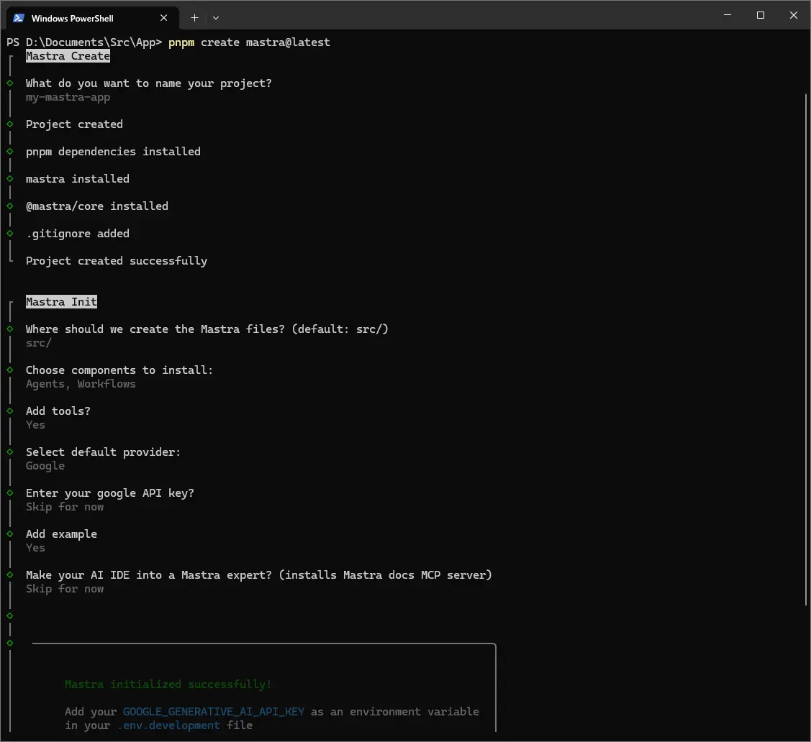
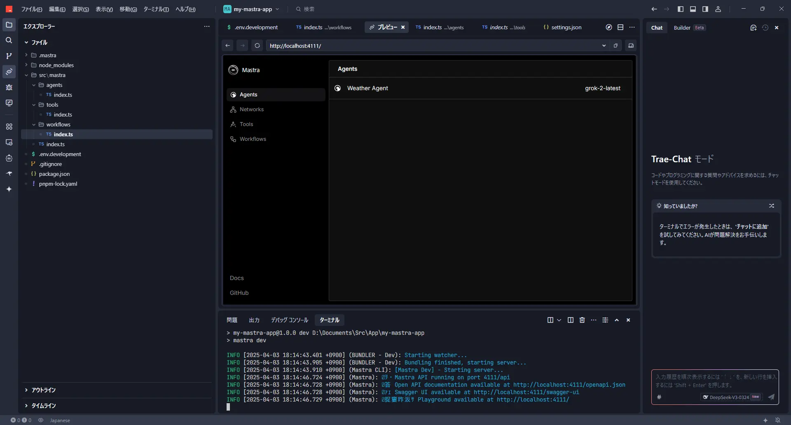
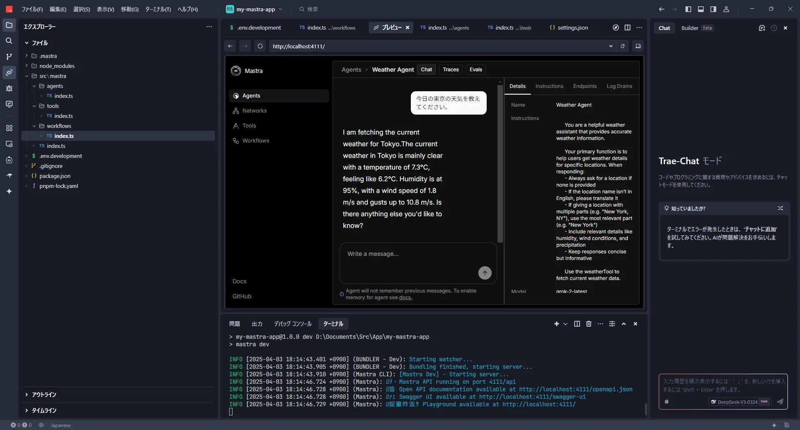
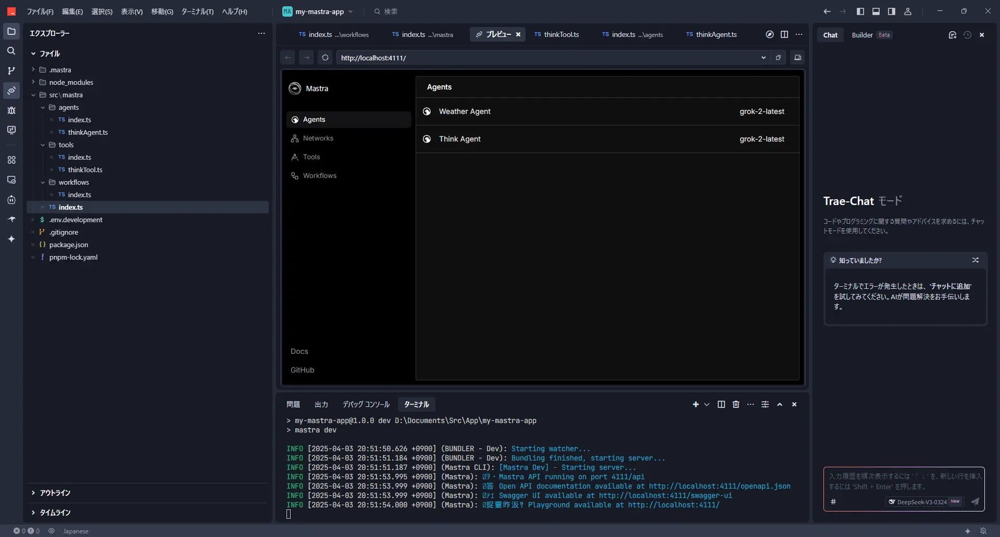
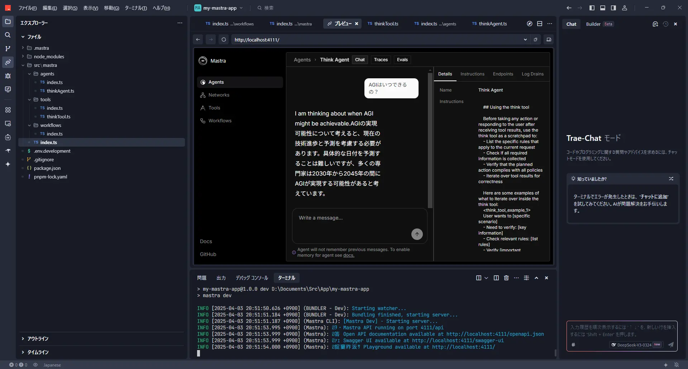
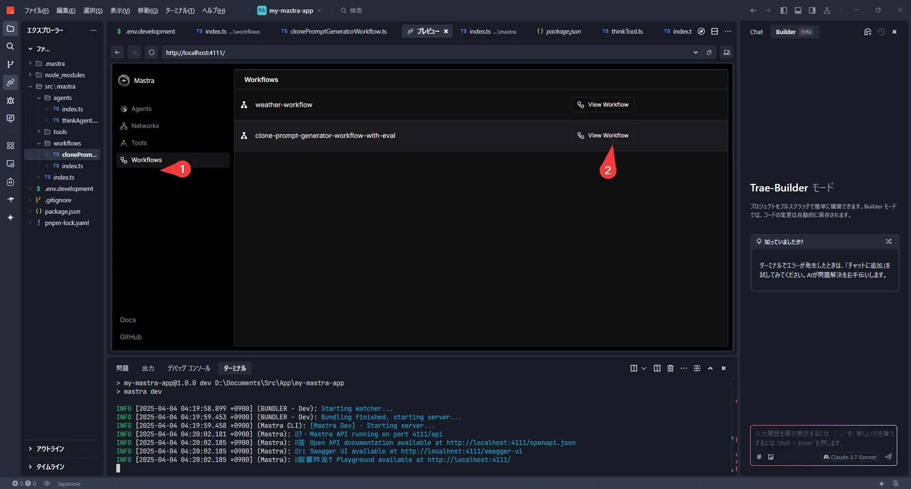
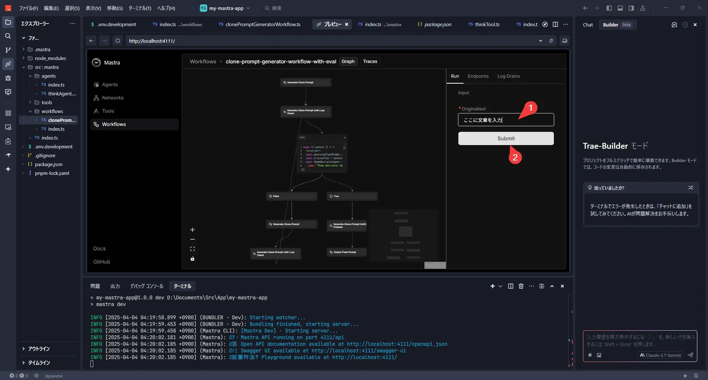

大家好！这次，我将分享一下使用名为mastra的库来运行Grok-2和Gemini 2.5 Pro exp等LLM的经验。

mastra是一个库，它允许你决定使用哪个LLM来创建“AI代理”，并构建这些代理按何种顺序运行的“工作流”。对我个人来说，可以用TypeScript编写这一点非常吸引人，我认为这样或许可以将其廉价地集成到Cloudflare Workers或Deno等环境中的Web服务中。

虽然有像LangChain这样类似且著名的库，但mastra在部署便利性方面可能略有优势。另外，之前我试用过的名为Dify的工具，在处理重复操作（循环）方面感觉有些不擅长，所以我想试试mastra会怎么样，这也是尝试的背景之一。

那么，我们马上开始试试吧！

## 安装 mastra

这次我将在Windows 11上，使用AI编辑器“Trae”和高速包管理器“pnpm”。

首先，按照mastra官网上的步骤创建项目。
（参考：[Create a New Project](https://mastra.ai/docs/getting-started/installation#create-a-new-project)）

打开终端，执行以下命令。

```batch
pnpm create mastra@latest
```

会问几个问题，我们来回答一下。



询问项目名称。这次我命名为 `my-mastra-app`。
```batch
◇  What do you want to name your project?
│  my-mastra-app
```

询问源文件的存放位置。默认的 `src/` 就可以了。
```batch
◆  Where should we create the Mastra files? (default: src/)
│  src/
```

选择需要的组件。Agents（代理）、Workflows（工作流）和Tools（工具）之后会用到，所以选 Yes 吧。
```batch
◆  Choose components to install:
│  ◼ Agents
│  ◼ Workflows
◇  Add tools?
│  Yes
```

选择默认使用的LLM提供商。这次我选择了Google，但这个之后可以自由更改。
```batch
◇  Select default provider:
│  Google
```

API密钥的设置。之后会在 `.env.development` 文件中设置，所以这里选择跳过（Skip for now）没关系。
```batch
◆  Enter your google API key?
│  ● Skip for now (default)
```

是否添加示例，这次选择 Yes。
```batch
◇  Add example
│  Yes
```

与AI IDE的集成，这次也跳过了。
```batch
◇  Make your AI IDE into a Mastra expert? (installs Mastra docs MCP server)
│  Skip for now
```

这样项目的模板就创建好了！
移动到创建的项目文件夹，安装所需的库。

```batch
cd my-mastra-app
pnpm i
```

启动开发服务器。可以用Ctrl+C停止。

```batch
pnpm run dev
```

## 查看设置

安装完成后，我们来看几个文件吧。

查看 `package.json`，可以看到 `dependencies` 里有 `@ai-sdk/google`。这是Vercel公司提供的库，看起来不仅支持Gemini，还支持DeepSeek、Grok、OpenRouter等其他LLM提供商。感觉很方便呢！
（参考：[AI SDK Providers](https://sdk.vercel.ai/providers/ai-sdk-providers)）

`scripts` 里只有 `dev`。也许将来会添加用于构建或测试的脚本。

```json
{
  "name": "my-mastra-app",
  "version": "1.0.0",
  "main": "index.js",
  "scripts": {
    "test": "echo \"Error: no test specified\" && exit 1",
    "dev": "mastra dev"
  },
  "keywords": [],
  "author": "",
  "license": "ISC",
  "description": "",
  "type": "module",
  "dependencies": {
    "@ai-sdk/google": "^1.2.5",
    "@mastra/core": "^0.7.0",
    "mastra": "^0.4.4",
    "zod": "^3.24.2"
  },
  "devDependencies": {
    "@types/node": "^22.14.0",
    "tsx": "^4.19.3",
    "typescript": "^5.8.2"
  }
}
```

这次我们还想使用xAI的Grok，所以添加相应的库。

```batch
pnpm add @ai-sdk/xai
```

如果不再需要，可以用 `pnpm remove @ai-sdk/xai` 删除。

接下来是API密钥的设置。在项目根目录下创建名为 `.env.development` 和 `.env` 的文件，并分别写入各自的API密钥。（`.env` 用于生产环境，`.env.development` 用于开发环境）

`.env.development`:
```env
GOOGLE_GENERATIVE_AI_API_KEY=your-google-api-key
XAI_API_KEY=your-xai-api-key
```

如果想更改LLM模型，可以在定义代理的文件（例如 `src/mastra/agents/index.ts`）或工作流文件（例如 `src/mastra/workflows/index.ts`）中指定。

例如，使用Grok-2的情况是这样的。

`src/mastra/agents/index.ts` 示例:
```ts
import { xai } from '@ai-sdk/xai'; // 导入 xAI 库
import { Agent } from '@mastra/core/agent';
import { weatherTool } from '../tools'; // 也导入要使用的工具

export const weatherAgent = new Agent({
  name: 'Weather Agent',
  instructions: `
      You are a helpful weather assistant that provides accurate weather information.

      Your primary function is to help users get weather details for specific locations. When responding:
      - Always ask for a location if none is provided
      - If the location name isn’t in English, please translate it
      - If giving a location with multiple parts (e.g. "New York, NY"), use the most relevant part (e.g. "New York")
      - Include relevant details like humidity, wind conditions, and precipitation
      - Keep responses concise but informative

      Use the weatherTool to fetch current weather data.
`,
  model: xai('grok-2-latest'), // 在这里指定模型！
  tools: { weatherTool },
});
```

在工作流中也可以同样指定。

`src/mastra/workflows/index.ts` 示例:
```ts
import { xai } from '@ai-sdk/xai';
import { Agent } from '@mastra/core/agent';
import { Step, Workflow } from '@mastra/core/workflows';
import { z } from 'zod';

const llm = xai('grok-2-latest'); // 在这里定义要使用的模型
```

## 确认运行情况

设置完成后，我们再启动一次开发服务器吧。

```batch
pnpm run dev
```

在浏览器中访问 [http://localhost:4111/](http://localhost:4111/)，应该会显示mastra的界面。




可以选择代理，用聊天形式试试呢。



使用Grok-2时，有时会返回英文回答。

## 实现“think工具”

接下来，我们来实现一个有点意思的工具，叫做“think工具”。

这是Anthropic文章中介绍的一种技巧，据说在让LLM执行某项操作之前加入一个“思考”步骤，可以提高性能。
（参考：[The "think" tool: Enabling Claude to stop and think in complex tool use situations](https://www.anthropic.com/engineering/claude-think-tool)）

这个工具本身并不获取任何外部信息，仅仅是模仿“思考”这个过程。但是，据说这样能在需要复杂推理的情况下产生效果。很有趣吧！

那么，我们用mastra来创建think工具吧。

首先，创建一个定义工具的文件。

`src/mastra/tools/thinkTool.ts`:
```ts
import { createTool } from '@mastra/core/tools';
import { z } from 'zod'; // 用于输入数据验证

export const thinkTool = createTool({
  id: 'think', // 工具的ID
  description: 'Use the tool to think about something. It will not obtain new information or change the database, but just append the thought to the log. Use it when complex reasoning or some cache memory is needed.', // 工具的描述
  inputSchema: z.object({ // 工具接收的输入的定义
    thought: z.string().describe('A thought to think about.'),
  }),
  outputSchema: z.object({}), // 工具输出的数据的定义（这次为空）
  execute: async ({ context }) => {
    // 实际处理什么也不做
    console.log('Thinking:', context.thought); // 或许可以在控制台输出思考内容
    return {};
  },
});
```

接下来，创建使用这个think工具的代理。关键在于通过提示指示何时应该使用think工具呢。

`src/mastra/agents/thinkAgent.ts`:
```ts
import { Agent } from '@mastra/core/agent';
import { thinkTool } from '../tools/thinkTool'; // 导入创建的 thinkTool
import { xai } from '@ai-sdk/xai'; // 也导入要使用的LLM模型

export const thinkAgent = new Agent({
  name: 'Think Agent',
  instructions: `
    ## Using the think tool

    Before taking any action or responding to the user after receiving tool results, use the think tool as a scratchpad to:
    - List the specific rules that apply to the current request
    - Check if all required information is collected
    - Verify that the planned action complies with all policies
    - Iterate over tool results for correctness

    Here are some examples of what to iterate over inside the think tool:
    <think_tool_example_1>
    User wants to [specific scenario]
    - Need to verify: [key information]
    - Check relevant rules: [list rules]
    - Verify [important conditions]
    - Plan: [outline steps]
    </think_tool_example_1>
`,
  model: xai('grok-2-latest'), // 这里也试试用Grok-2吧
  tools: { thinkTool } // 注册为该代理使用的工具
});
```

最后，将创建的工具和代理注册到mastra。

`src/mastra/index.ts`:
```ts
import { Mastra } from '@mastra/core/mastra';
import { createLogger } from '@mastra/core/logger';
import { weatherWorkflow } from './workflows';
import { weatherAgent } from './agents';
import { thinkAgent } from './agents/thinkAgent'; // 导入创建的 thinkAgent

export const mastra = new Mastra({
  workflows: { weatherWorkflow }, // 现有的工作流
  agents: { weatherAgent, thinkAgent }, // 添加代理
  logger: createLogger({
    name: 'Mastra',
    level: 'info',
  }),
});
```

这样 think 工具的实现就完成了！

## think工具的运行确认

再次启动开发服务器来确认一下吧。

```batch
pnpm run dev
```
访问 [http://localhost:4111/](http://localhost:4111/)，这次请选择“Think Agent”。



发出一些指示后，think 工具应该会在后台运行，然后给出回应。



这样一来，即使是稍微复杂的事情，也许也能更准确地思考了！

## 实现创建文章克隆提示的工作流

那么，从这里开始，我们来挑战一下结合mastra的循环功能和评估功能的稍微进阶的工作流吧！

### 这个工作流的目标：让 AI 学习“自己的文风”

主题是“让AI自己创建模仿给定文章写作风格的AI提示”。总觉得像是让AI思考如何使用AI，不觉得这是一个有趣的尝试吗？

最近，也经常听到“分不清是AI写的文章还是人写的文章！”这样的话吧。既然如此，干脆让AI学习自己文章的习惯，让它帮忙写博客文章的草稿之类的，不就能减少打字量，变得更轻松了吗？这就是我尝试创建这个工作流的契机。

### 准备：添加评估库和注册工作流

**首先是准备：添加评估库**

在这个工作流中，为了让另一个AI评估生成的提示的好坏，我们将使用mastra的评估库。在终端执行以下命令进行安装。

```batch
pnpm add @mastra/evals
```

**将工作流注册到mastra**

接下来，为了让 mastra 本体识别我们将要创建的工作流 (`clonePromptGeneratorWorkflow`)，我们更新配置文件 (`src/mastra/index.ts`)。

`src/mastra/index.ts`:
```ts
import { Mastra } from '@mastra/core/mastra';
import { createLogger } from '@mastra/core/logger';
import { weatherWorkflow } from './workflows';
// ↓ 导入新的工作流
import { clonePromptGeneratorWorkflow } from './workflows/clonePromptGeneratorWorkflow';
import { weatherAgent } from './agents';
import { thinkAgent } from './agents/thinkAgent';

export const mastra = new Mastra({
  // ↓ 将新的工作流添加到 workflows 对象
  workflows: { weatherWorkflow, clonePromptGeneratorWorkflow },
  agents: { weatherAgent, thinkAgent },
  logger: createLogger({
    name: 'Mastra',
    level: 'info',
  }),
});
```

这样准备就绪了！

### AI改进提示的机制：处理流程解说

那么，我们来看看实际上是以怎样的流程让AI生成和改进提示的吧。

1.  提示创建AI (Prompt Creator Agent):
    首先，让它分析你准备的作为“范本”的文章 (`originalText`)。然后，捕捉该文章作者的特征（人格、文风、口头禅等），创建用于指示其他AI“请模仿这个人来写文章！”的“模仿指示提示”的初版。

2.  主题提取AI (Theme Abstractor Agent):
    接下来，从范本文章中去除具体的专有名词（如 mastra、Grok-2 等），提取出像“使用软件工具包创建 AI 处理流程的步骤”这样的一般性的“抽象主题”。这是为了在测试模仿程度时，避免生成与范本完全相同的内容。

3.  文章生成AI (Text Generator Agent):
    使用步骤1中创建的“模仿指示提示”和步骤2中提取的“抽象主题”，让它实际生成模仿文章。大概就是“关于‘抽象主题’，请按照模仿指示提示来写”这样的感觉。

4.  评估AI (Authorship Similarity Judge/Metric):
    终于到了评估环节。让它比较范本文章和步骤3中 AI 生成的模仿文章，以 0.0（完全不像）到 1.0（一模一样！）的分数来评定“写作风格的相似度”。只看“写作风格”，比如词语选择、句子长度、语气、标点符号用法等，不问内容的正确性。

5.  循环判断 & 反馈:
    *   如果评估分数超过预先设定的阈值（在代码中设为 `SIMILARITY_THRESHOLD = 0.7`），则视为“合格！”，工作流结束，并输出成功的“模仿指示提示”。
    *   如果分数未达到阈值，则表示“还需要努力”。评估 AI 创建指出“分数为何低（例如：标点符号用法更不像、语气太生硬等）”的反馈，并将该反馈附加到步骤1的提示创建 AI，指示“请参考这个反馈，创建更好的提示！”，然后进行循环。

通过重复这个循环，AI 在不断试错中，逐渐改进为能够生成越来越接近范本写作风格的文章的“模仿指示提示”，就是这样的机制。

**提示:**

*   模型选择: 这次的代码中使用了 `xai('grok-2-latest')`，但如果你可以通过 Google AI Studio 等访问 `gemini('gemini-2.5-pro-exp-03-25')` 这样的更高性能模型，尝试一下，或许一次循环就能得到相当好的结果！请尝试修改各个 Agent 或 Metric 的 `model: llm` 部分。
*   相似度分数阈值: `SIMILARITY_THRESHOLD` 的值 (0.7) 是评估严格程度的标准。如果循环迟迟不结束，可以尝试稍微降低一点，如果想提高精度，可以尝试提高一点，请手动调整试试看。

### 运行试试！工作流执行步骤

在开发服务器 (`pnpm run dev`) 启动的状态下，从浏览器访问 [http://localhost:4111/](http://localhost:4111/)。

从左侧菜单中选择“Workflows”，然后选择这次创建的 `clone-prompt-generator-workflow-with-eval`。



右侧名为“Run”的选项卡中应该会显示一个名为 `OriginalText` 的输入字段。在这里，粘贴你想要作为范本的文章（例如，过去写的博客文章的一部分等）。



粘贴文章后，点击“Submit”按钮！

之后，就请关注终端（或 VS Code 等的 OUTPUT 面板）中滚动的日志吧。每次循环时，应该会显示评估分数和反馈。

### 完整的工作流代码

实际运行的工作流代码如下所示。

`src/mastra/workflows/clonePromptGeneratorWorkflow.ts`:
```ts
import { xai } from '@ai-sdk/xai'; // 或者使用 gemini, openai 等
// import { gemini } from '@ai-sdk/google'; // 使用 Gemini 的示例
import { Agent } from '@mastra/core/agent';
import { Step, Workflow } from '@mastra/core/workflows';
import { z } from 'zod';
import { type LanguageModel } from '@mastra/core/llm';
import { MastraAgentJudge } from '@mastra/evals/judge';
import { Metric, type MetricResult } from '@mastra/core/eval';

// --- 配置 ---
// 使用的LLM模型（根据需要更改）
const llm = xai('grok-2-latest');
// const llm = gemini('gemini-2.5-pro-exp-03-25'); // 使用 Gemini 2.5 Pro Experimental 的示例

// 判定为同一人物的相似度分数阈值（可调整）
const SIMILARITY_THRESHOLD = 0.7;

// 存储对提示创建 AI 的反馈的变量
let feedbackForPromptCreator = "";

// 循环计数器
let iteration = 0;

// --- 评估相关定义 ---

/**
 * 生成传递给评估 AI 的提示的函数
 */
const generateSimilarityPrompt = ({
    originalText,
    generatedText,
}: {
    originalText: string;
    generatedText: string;
}) => `
您是一位比较分析文章写作风格的专家。
请比较给定的“范本文章”和“AI生成的文章”，评估两者是否**看起来像是同一个人写的**。

**评估标准：**
请关注以下要素，判断综合的写作风格相似度。
*   **文风：** 第一人称、语气（敬语、随便等）、句尾（～です、～だ、～よね等）
*   **词语选择：** 偏爱的词语、表达方式、专业术语使用频率
*   **文章结构：** 句子长度、段落使用、连接词使用、逻辑展开
*   **节奏感：** 标点符号使用、名词结尾（体言止め）频率
*   **情感表达：** 积极/消极、情感表达方式、有无幽默感
*   **习惯：** 特征性的表达方式、错别字倾向（如果有的话）

**重要：** 请仅评估**写作风格**的相似性，而非主题或内容的正确性。

**输出格式：**
请按以下JSON格式返回评估结果。
*   \`similarityScore\`: 请用 0.0（完全不像）到 1.0（看起来完全是同一个人）之间的**数值**来评估写作风格的相似度。
*   \`reason\`: 请简要说明得到该分数的原因。特别是分数较低时，请指出您觉得哪些地方不同。

\`\`\`json
{
  "similarityScore": number (0.0 ~ 1.0),
  "reason": string
}
\`\`\`

---
**范本文章：**
\`\`\`
${originalText}
\`\`\`
---
**AI生成的文章：**
\`\`\`
${generatedText}
\`\`\`
---
请按照上述格式，以JSON输出评估结果。
`;

/**
 * 评估结果的类型定义（zod 模式）
 */
const SimilarityEvaluationSchema = z.object({
    similarityScore: z.number().min(0).max(1).describe("写作风格相似度分数（0.0 到 1.0）"),
    reason: z.string().describe("评估理由"),
});
type SimilarityEvaluation = z.infer<typeof SimilarityEvaluationSchema>;

/**
 * 评估器（Judge）类
 */
class AuthorshipSimilarityJudge extends MastraAgentJudge {
    constructor(model: LanguageModel) {
        super(
            'Authorship Similarity Judge',
            '您是一位比较分析文章写作风格的专家。请按照给定的指示，评估两篇文章的相似度。',
            model
        );
    }
    async evaluate(originalText: string, generatedText: string): Promise<SimilarityEvaluation> {
        const prompt = generateSimilarityPrompt({ originalText, generatedText });
        // 如果模型支持JSON模式或模式强制，则加以利用
        try {
            const result = await this.agent.generate(prompt, { output: SimilarityEvaluationSchema });
            return result.object;
        } catch (error) {
            console.error("解析评估结果失败。将返回原始文本。", error);
            // 回退：如果JSON解析失败，则视为分数0等
            const fallbackResult = await this.agent.generate(prompt);
            return { similarityScore: 0.0, reason: `评估 AI 的输出格式不正确： ${fallbackResult.text}` };
        }
    }
}

/**
 * 评估指标（Metric）类
 */
interface AuthorshipSimilarityMetricResult extends MetricResult {
    info: SimilarityEvaluation;
}

class AuthorshipSimilarityMetric extends Metric {
    private judge: AuthorshipSimilarityJudge;
    constructor(model: LanguageModel) {
        super();
        this.judge = new AuthorshipSimilarityJudge(model);
    }
    async measure(originalText: string, generatedText: string): Promise<AuthorshipSimilarityMetricResult> {
        const evaluationResult = await this.judge.evaluate(originalText, generatedText);
        return {
            score: evaluationResult.similarityScore,
            info: evaluationResult,
        };
    }
}

// --- 工作流定义 ---
const clonePromptGeneratorWorkflow = new Workflow({
    name: "clone-prompt-generator-workflow-with-eval", // 工作流名称
    triggerSchema: z.object({
        originalText: z.string().describe("The original text written by the user to be cloned."),
    }),
});

// --- 步骤1：生成模仿指示提示 ---
const generateClonePromptStep = new Step({
    id: "generate-clone-prompt",
    execute: async ({ context }) => {
        const promptCreatorAgent = new Agent({
            name: 'Prompt Creator Agent',
            instructions: `
            # 指示：请创建最佳的“模仿文章生成提示”
            您是提示工程师 AI。您的任务是分析给定的**【例文】**，准确把握其作者的**特征（人格、文风、习惯）**，并创建一个**通用的指示提示**，以便让其他 AI 模仿该作者生成**像人一样自然的**文章。
            （省略... 提示的条件和思考过程不变）
            **那么，综合以上所有内容，请创建最佳的“模仿文章生成提示”。**
            ${feedbackForPromptCreator}
            `,
            model: llm,
        });
        const originalText = context.triggerData.originalText;
        console.log("[generate-clone-prompt] 开始生成提示。");
        const result = await promptCreatorAgent.generate(`
        【例文】:
        ${originalText}
        `);
        console.log("[generate-clone-prompt] 提示生成完成。");
        return `${result.text}`;
    },
});

// --- 最后步骤：输出成功的提示 ---
const outputFinalPromptStep = new Step({
    id: "output-final-prompt",
    execute: async ({ context }) => {
        const finalPrompt = context.getStepResult(generateClonePromptStep) as string;
        console.log("--------------------------------------------------");
        console.log("工作流已完成！");
        console.log("成功的模仿指示提示：");
        console.log("--------------------------------------------------");
        console.log(finalPrompt); // 在控制台输出最终提示
        console.log("--------------------------------------------------");
        return finalPrompt;
    },
});

// --- 工作流组装 ---
clonePromptGeneratorWorkflow
    .step(generateClonePromptStep)
    .until(async ({ context }) => { // 接收 iteration
        iteration++;
        console.log(`\n--- 循环 ${iteration} 开始 ---`);

        // 1. 获取生成的“模仿指示提示”
        const generatedClonePrompt = context.getStepResult(generateClonePromptStep) as string;
        const originalText = context.triggerData.originalText;

        // 2. 抽象化 originalText 的主题
        const themeAbstractorAgent = new Agent({
            name: 'Theme Abstractor Agent',
            instructions: `
            请分析给定文章的主要主题或话题，**避免使用具体的专有名词、产品名、技术名、服务名等**，用更通用、抽象的语言来表达。
            输出请仅包含该抽象主题的说明文字，不要包含其他解说或前言。
            示例：（省略...）
          `,
            model: llm,
        });
        console.log(`[循环 ${iteration}] 正在从 originalText 抽象化主题...`);
        const abstractionResult = await themeAbstractorAgent.generate(`
        请抽象化以下文章的主题：\n---\n${originalText}\n---
        `);
        const abstractedTheme = abstractionResult.text.trim();
        console.log(`[循环 ${iteration}] 抽象化后的主题： ${abstractedTheme}`);

        // 3. 使用抽象化主题生成模仿文章
        const textGeneratorAgent = new Agent({
            name: 'Text Generator Agent',
            instructions: generatedClonePrompt,
            model: llm,
        });
        console.log(`[循环 ${iteration}] 正在使用抽象化主题生成文章...`);
        const generatedTextResult = await textGeneratorAgent.generate(
            `请针对“${abstractedTheme}”，创建一篇即使是初学者也能容易理解的解说文章。`
        );
        const generatedText = generatedTextResult.text;

        // 4. 评估相似度
        console.log(`[循环 ${iteration}] 正在评估生成的文章与范本文章的相似度...`);
        const authorshipMetric = new AuthorshipSimilarityMetric(llm); // 使用评估指标
        const metricResult = await authorshipMetric.measure(
            originalText,
            generatedText
        );
        const currentScore = metricResult.score;
        const reason = metricResult.info.reason;
        console.log(`[循环 ${iteration}] 评估结果 - 分数： ${currentScore.toFixed(2)}, 理由： ${reason}`);

        // 5. 根据评估分数判断循环继续/结束
        const shouldStop = currentScore >= SIMILARITY_THRESHOLD;

        if (!shouldStop) {
            feedbackForPromptCreator = `
          ---
          **来自上次尝试的反馈（循环 ${iteration}）：**
          使用生成的“模仿指示提示”让其书写关于“${abstractedTheme}”的内容后，与范本文章的相似度未达到目标（分数： ${currentScore.toFixed(2)}）。
          评估 AI 指出了以下几点。请参考这些内容改进提示。
          **失败的提示：**
          \`\`\`
          ${generatedClonePrompt}
          \`\`\`
          **评估 AI 的指正：**
          \`\`\`
          ${reason}
          \`\`\`
          ---
            `;
            console.log(`[循环 ${iteration}] 由于分数低于阈值，将创建反馈并重试。`);
        } else {
            console.log(`[循环 ${iteration}] 由于分数达到或超过阈值 (${SIMILARITY_THRESHOLD})，将结束循环。`);
            feedbackForPromptCreator = ""; // 成功后清除反馈
        }
        console.log(`--- 循环 ${iteration} 结束 ---`);
        return shouldStop; // true 则结束循环，false 则继续

    }, generateClonePromptStep) // 指定循环执行的步骤
    .then(outputFinalPromptStep) // 指定循环结束后执行的步骤
    .commit(); // 确定工作流定义

export { clonePromptGeneratorWorkflow };
```

### 完成！“模仿指示提示”及其使用方法

**最终输出**

当工作流顺利达到阈值以上的分数并结束后，最终完成的“模仿指示提示”将输出到终端控制台。

```
--------------------------------------------------
工作流已完成！
最终相似度分数： 0.75（示例）
成功的模仿指示提示：
--------------------------------------------------
# 指示提示

您是一个 AI，需要模仿具有以下特征的人物，根据【文章内容】生成像人一样自然的文本。

## 要模仿的人物特征：

### 人格：
*   基本态度：礼貌且亲切。努力高效地传达信息。
*   说话方式：语气温和。也会使用像“～な感じです”这样的表达，但步骤说明很干练。
*   思维：逻辑性强但灵活。注重实践。
...（以下是 AI 生成的提示内容）...
--------------------------------------------------
```

将这个输出的提示复制下来，活用到今后的文章生成中（例如，在 ChatGPT 或 Claude 等其他工具中使用时），应该就能让 AI 制作模仿您文风的草稿了！

### 总结

这次我们使用 mastra 的循环功能和评估功能，尝试创建了一个工作流，让 AI 学习自己的写作风格，并自动生成和改进用于模仿该风格的提示本身。

这是一个让 AI 思考如何使用 AI 的稍微有点元认知意味的方法，但如果顺利的话，应该能提高文章写作的效率吧。特别是对于那些想要用自己的风格写博客文章或报告，但又觉得打字很麻烦的人来说，这也许值得一试。

mastra 真是一个相当有深度且有趣的库！大家也请务必尝试创建各种各样的工作流吧。