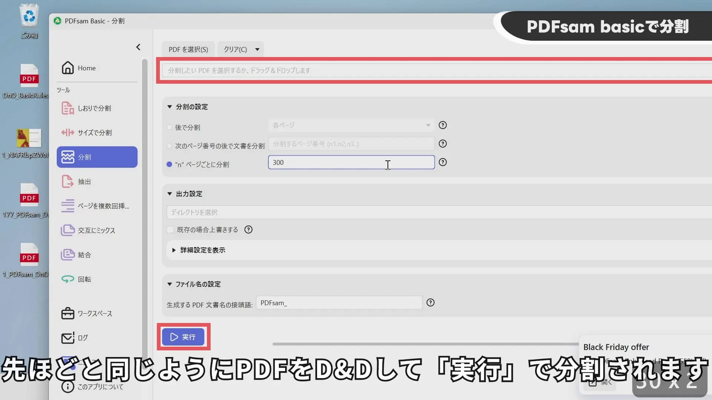

## YouTube Video

Translate Entire eBook PDFs with Google Translate (Free!)


## Google Translate

Access Google Translate at the following URL:
https://translate.google.com/

Images can be translated.

The original text is masked with a background color, and the translated text is superimposed.  You can download the translated image using the "Download translation" button.

Files exceeding 10MB or 300 pages cannot be translated.
The following file formats are supported:
- .docx
- .pdf
- .pptx
- .xlsx

## PDFsam Basic

Download PDFsam Basic from the following URL:
https://pdfsam.org/download-pdfsam-basic/
I downloaded the "Portable archive" version.

It appears to configure Java settings upon launch. Run it using the "pdfsam.bat" file.

Use this option if the file size exceeds 10MB.  It's recommended to set "Split by file size" to 5.6MB.  This is because splitting at 10MB sometimes caused timeout errors with Google Translate.

Use this option if the page count exceeds 300 pages. Set "Split after every 'n' pages" to 300. If you encounter timeouts, reduce this value to 200 or 100.

Drag and drop the split PDF files as shown in the image.

Click "Run" to merge the files.  The merged file will have a default name, so renaming is necessary.

## PDFsam Visual

This is not recommended as it only offers a 14-day trial. However, it's mentioned here due to its effective compression of text-based PDFs.

Download PDFsam Visual from the following URL:
https://pdfsam.org/download-pdfsam-visual/
I downloaded the "Portable archive 64-bit" version.

Select "Compress" on the start screen.

Drag and drop your PDF file here.

Configure the settings: choose the output folder with "BROWSE" and click "SAVE" to compress.

## iLovePDF

Go to the iLovePDF "Compress PDF" page at the following URL:
https://www.ilovepdf.com/compress_pdf

Drag and drop your PDF file here.

Select "Extreme compression" and click "Compress PDF".