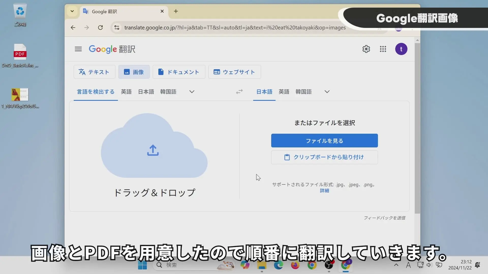
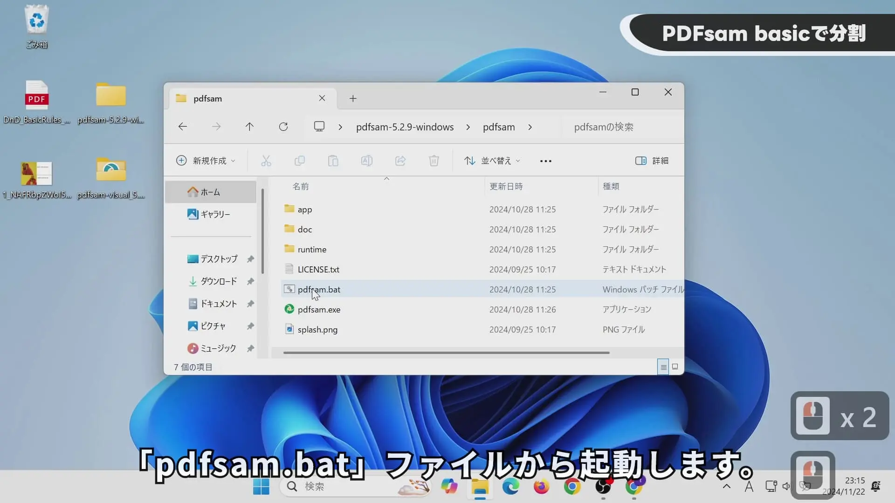
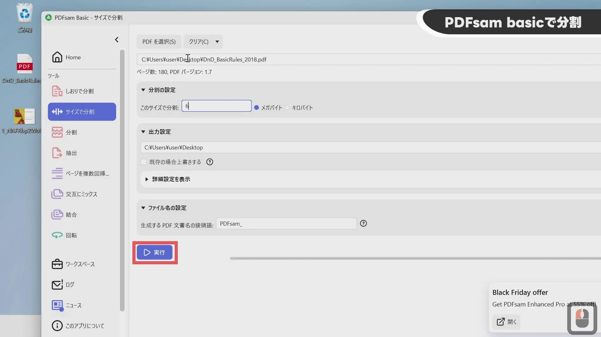
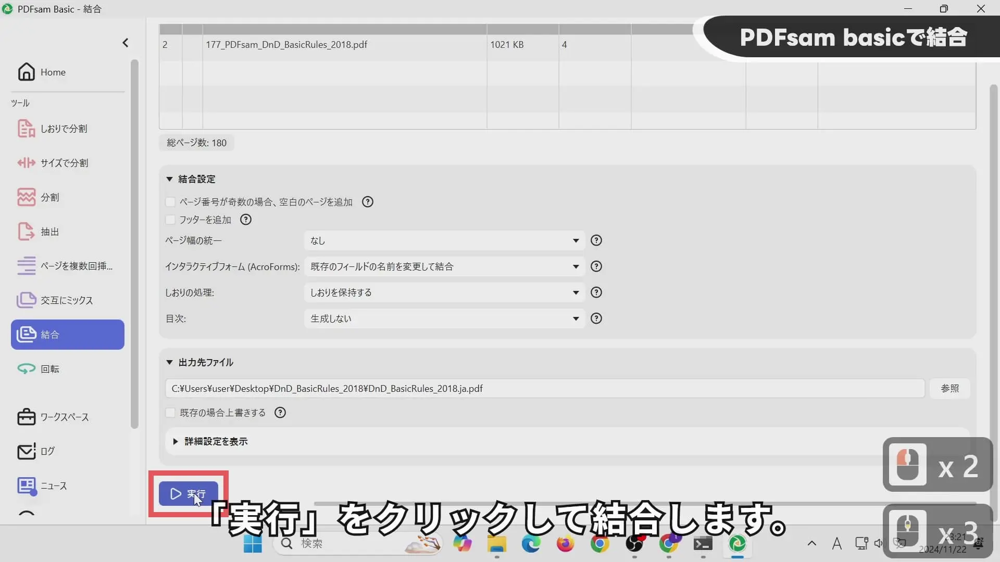
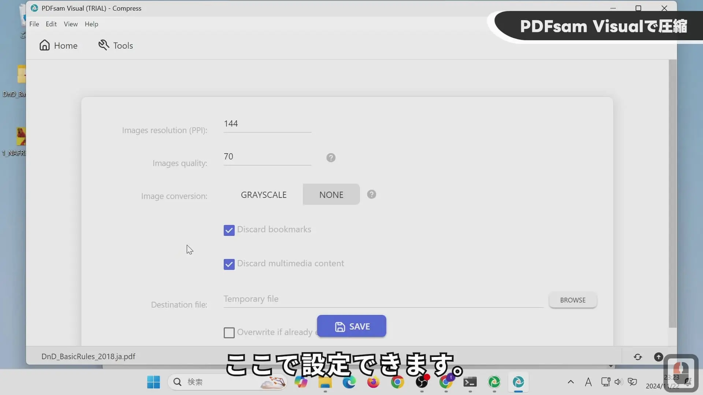

## YouTube動画

【無料】電子書籍のPDFをまるごとGoogle翻訳！


## Google翻訳

次のURLからGoogle翻訳に行きます。
https://translate.google.co.jp/

画像が翻訳できます。

背景色で元の文字を消してから翻訳後の文章を書いてくれます。
「翻訳をダウンロード」で画像をダウンロードできます。

10MBを超えたり、300ページを超えたりすると翻訳できないです。
以下の形式のファイルが翻訳できます。
- .docx
- .pdf
- .pptx
- .xlsx

## PDFsam Basic

次のURLからPDFsam Basicをダウンロードします。
https://pdfsam.org/download-pdfsam-basic/
「Portable archive」をダウンロードしました。

起動時にJavaの設定をしているようで「pdfsam.bat」ファイルから起動します。

ファイルサイズが10MBを超える場合に使用します。
「このサイズで分割」を5,6MBに指定してから分割するとよいです。
理由は、10MBで分割したときにGoogle翻訳がタイムアウトエラーを起こしたからです。

ページ数が300ページを超える場合に使用します。
「"n"ページごとに分割」を300に指定します。
もしタイムアウトする場合は、200や100と数値を下げていってください。

分割されたPDFファイルを画像のようにドラッグアンドドロップします。

「実行」で結合します。デフォルトネームがつけられるので、名前変更が必要です。

## PDFsam Visual

14日間の試用期間のみ使用できるので、おすすめしません。
しかし、文章のみのPDFの圧縮率が良かったため、紹介します。

次のURLからPDFsam Visualをダウンロードします。
https://pdfsam.org/download-pdfsam-visual/
「Portable archive 64-bit」をダウンロードしました。

起動画面で「Compress」を選択します。

ここにPDFをドラッグアンドドロップします。
        

設定は「BROWSE」で保存先フォルダを選んで「SAVE」で圧縮します。

## iLovePDF

次のURLからiLovePDFの「PDF圧縮」に行きます。
https://www.ilovepdf.com/ja/compress_pdf

ここでPDFファイルをD&Dします。

   
「最も高い圧縮率」を選んで「PDF圧縮」します。