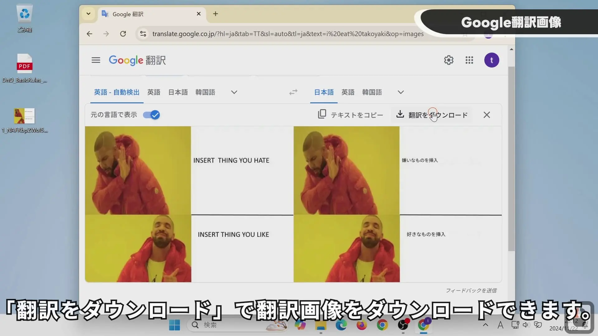
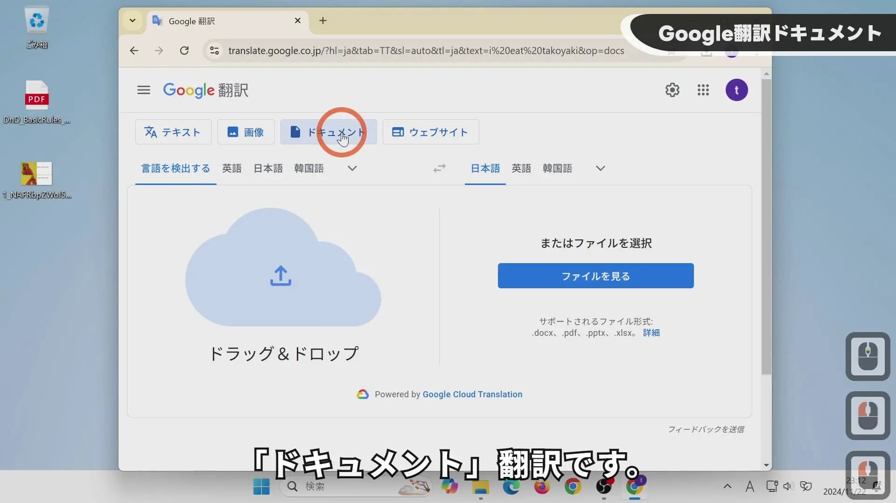

## YouTube视频

【免费】用谷歌翻译完整翻译电子书PDF！


## 谷歌翻译

请访问以下网址使用谷歌翻译：
https://translate.google.co.jp/

可以翻译图片。

谷歌翻译会用背景色遮盖原文，然后在其上显示翻译后的文本。
点击“下载译文”即可下载翻译后的图片。

超过 10MB 或 300 页的文件无法翻译。
支持以下文件格式：
- .docx
- .pdf
- .pptx
- .xlsx

## PDFsam Basic

请访问以下网址下载 PDFsam Basic：
https://pdfsam.org/download-pdfsam-basic/
我们下载了“Portable archive”版本。

启动时似乎会进行 Java 设置，请通过“pdfsam.bat”文件启动。

当文件大小超过 10MB 时使用此功能。
建议将“分割大小”设置为 5.6MB。
这是因为以 10MB 分割时，谷歌翻译出现了超时错误。

当页数超过 300 页时使用此功能。
将“每隔 n 页分割”设置为 300。
如果出现超时，请尝试将数值降低至 200 或 100。

如图所示，将分割后的 PDF 文件拖放到此处。

点击“运行”进行合并。合并后的文件会使用默认文件名，需要进行重命名。

## PDFsam Visual

由于只有 14 天的试用期，因此不推荐使用。
但是，由于其对纯文本 PDF 的压缩率很高，这里也进行介绍。

请访问以下网址下载 PDFsam Visual：
https://pdfsam.org/download-pdfsam-visual/
我们下载了“Portable archive 64-bit”版本。

在启动画面中选择“Compress”。

将 PDF 文件拖放到此处。

通过“BROWSE”选择保存目标文件夹，然后点击“SAVE”进行压缩。

## iLovePDF

请访问以下网址使用 iLovePDF 的“压缩 PDF”功能：
https://www.ilovepdf.com/ja/compress_pdf

将 PDF 文件拖放到此处。

选择“推荐压缩”或“极限压缩”，然后点击“压缩PDF”。