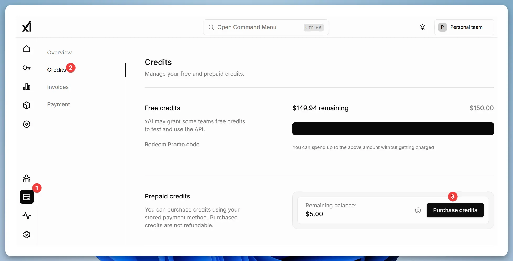

## How to Pay $5 to xAI and Get $150 in Credits Every Month

I registered for xAI by following the steps outlined in this article: 

[Grok API: Pay $5 and Get $150 Worth of Usage?](https://zenn.dev/schroneko/articles/de3a8f574e9ea4)

Start by visiting the [xAI Cloud Console](https://console.x.ai/).

  

Click in the order of 1 and 2 as shown in the image to enter your "Billing address."

  

The image is just an example; I filled it out in English. It should match the address associated with your credit card.  
I left the "Tax ID Type" and "Tax Number" fields blank since they’re optional. I’m not entirely sure about the tax implications here.

Next, enter your "Payment methods."

  

I used a PayPay JCB card, and it worked fine. (Note: PayPay is a payment service popular in Japan, but any valid credit card should work.)

  

There’s a field labeled "Redeem Promo code," but as of February 20, I couldn’t find any promo codes even after searching with xAI’s DeepResearch tool. It seems there aren’t any available right now.  
To buy credits, click "Purchase credits."

  

A $5 purchase is sufficient. After paying $5, a "Share Data" button will appear (I forgot to capture a screenshot of this).  
As explained in this article, by agreeing to share data with xAI, you can receive $150 in credits every month:  

[Get $150 in free API credits each month](https://docs.x.ai/docs/data-sharing)

## How to Use xAI with VSCode Extensions

### Using Grok API with Cody

[Cody: AI Code Assistant](https://marketplace.visualstudio.com/items?itemName=sourcegraph.cody-ai) is an AI-powered extension that offers code completion, editing, and chat features.  
Code completion is always free, but code editing and chat come with usage limits. By integrating the Grok API for editing and chat, you can unlock an unrestricted AI coding experience for just $5.

  

As shown in the image, navigate to "File" → "Preferences" → "Settings," then click the icon in the top-right corner to open "settings.json."  
Alternatively, press "Ctrl" + "Shift" + P and select "Preferences: Open Settings (JSON)."

Here's how to set up the models you want to add inside `"cody.dev.models"`. Since Grok is an OpenAI-compatible API, specify `"openai"` as the provider.  
Additionally, I've set up the DeepSeek and Gemini APIs as well. DeepSeek is also an affordable API that you can use.  
Gemini is an API provided by Google and is free to use. (Since there are restrictions on continuous usage, I'm using multiple instances.)  
For `"inputTokens"`, `"temperature"`, and `"stream"`, I'm using the official examples as they are.

```json
{
    "cody.dev.models": [
        {
            "provider": "openai", 
            "model": "grok-2-latest",
            "inputTokens": 131072,
            "outputTokens": 8192,
            "apiKey": "xai-xxxxxxxxxxxxxxxxxxxxxxxx",
            "options": {
                "temperature": 0,
                "stream": false
            },
            "apiEndpoint": "https://api.x.ai/v1"
        },
        {
            "provider": "groq",
            "model": "deepseek-chat",
            "inputTokens": 128000,
            "outputTokens": 8192,
            "apiKey": "sk-xxxxxxxxxxxxxxxxxxxxxxxx",
            "options": {
                "temperature": 0.6
            },
            "apiEndpoint": "https://api.deepseek.com/chat/completions"
        },
        {
            "provider": "google",
            "model": "gemini-2.0-pro-exp-02-05",
            "inputTokens": 2097152,
            "outputTokens": 8192,
            "apiKey": "AIxxxxxxxxxxxxxxxxxxxxxxxx",
            "options": {
              "temperature": 1.0
            }
        },
        {
            "provider": "google",
            "model": "gemini-2.0-flash-exp",
            "inputTokens": 1048576,
            "outputTokens": 8192,
            "apiKey": "AIxxxxxxxxxxxxxxxxxxxxxxxx",
            "options": {
              "temperature": 1.0
            }
        }
    ],
    
    "cody.edit.preInstruction": "Please think thoughts in English. Output should be in English.",
    "cody.chat.preInstruction": "Please think thoughts in English. Output should be in English."
}
```

For code editing (`"cody.edit.preInstruction"`) and chat (`"cody.chat.preInstruction"`), you can set custom prompts, similar to those used in ChatGPT.

### Using Grok API with Cline

[Cline](https://marketplace.visualstudio.com/items?itemName=saoudrizwan.claude-dev) seems to be an AI agent. It can read and write files, create new ones, and execute commands. Since it interacts with the API multiple times, it tends to consume a lot of tokens.

  

Cline can be configured using the "OpenAI Compatible" option, as shown in the image. Once you’ve completed the setup, click "Done" to save your settings.

### Using Grok API with Roo Code

[Roo Code (prev. Roo Cline)](https://marketplace.visualstudio.com/items?itemName=RooVeterinaryInc.roo-cline) is a fork of Cline, offering faster updates and more features.

  

Roo Code can also be set up using the "OpenAI Compatible" option, as shown in the image. After finishing the configuration, click "Done" to save.