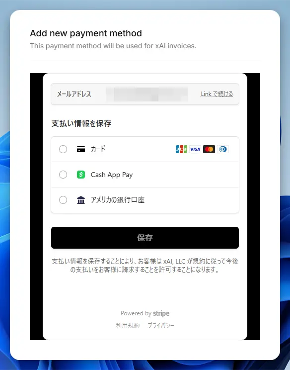
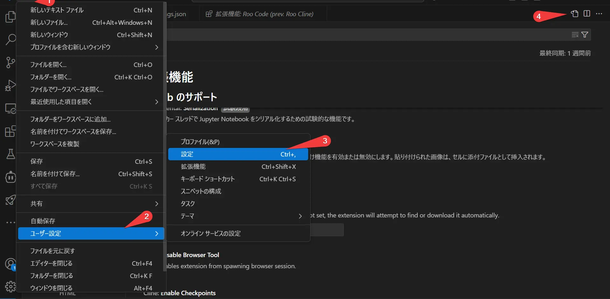
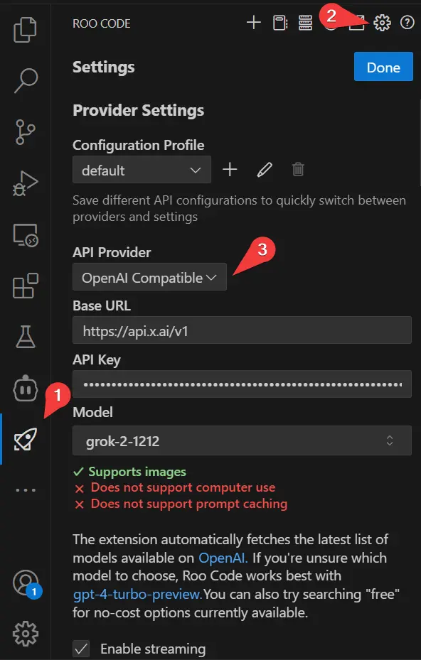

## xAIに5ドル課金して毎月150ドル分のクレジットをもらう方法

以下の記事を参考にしてxAIに登録しました。

[Grok API にて $5 課金すると $150 分使えるようになるらしい？](https://zenn.dev/schroneko/articles/de3a8f574e9ea4)

[xAI Cloud Console](https://console.x.ai/)に行きます。


この画像の1、2の順番でクリックして「Billing address」を入力します。


画像は例で、英語で記入しました。クレジットカードと同じ住所だと思います。
Tax ID TypeとTax Numberはオプションなので書きませんでした。
税金関係だろうけれど、わかりません。
次に「Payment methods」を入力します。



PayPayのJCBカードで通りました。


「Redeem Promo code」というプロモコードの入力欄がありましたが、2月20日ではxAIのDeepResearchをしても見つかりませんでした。多分ないようです。
「Purchase credits」からクレジットを購入します。


5ドルで大丈夫でした。
5ドルを課金すると「Share Data」ボタンが表示されますが、スクショを取り忘れました。
次の記事にあるように、xAIとデータを共有する代わりに毎月150ドル分のクレジットがもらえるようです。

[Get $150 in free API credits each month](https://docs.x.ai/docs/data-sharing)

## VSCodeの拡張機能でxAIを使う方法

### CodyでGrokのAPIを使う

[Cody: AI Code Assistant](https://marketplace.visualstudio.com/items?itemName=sourcegraph.cody-ai)はAIを使ったコード補完やコード編集、チャットなどの拡張機能です。
コード補完がずっと無料で、コード編集とチャットは回数制限があります。
なので、コード編集とチャットにGrokのAPIを設定することで、たった5ドルで制限なしのAIエディターを使えるようになります。



画像のように「ファイル」→「ユーザー設定」→「設定」から右上のアイコンから「settings.json」を開きます。
別の方法で「Ctrl」 + 「Shift」 + Pを押して「Preferences: Open Settings (JSON)」でも開けます。

次のように`"cody.dev.models"`の中に追加したいモデルを設定します。grokはOpenAI互換のAPIなので`"openai"`を指定します。
ついでにDeepSeekとGeminiのAPIも設定しています。DeepSeekも格安で使えるAPIです。
GeminiはGoogleの提供するAPIで無料で使えます。（連続で使用すると制限があるため、複数使用しています。）
`"inputTokens"`や`"temperature"`、`"stream"`は公式の例をそのまま使っています。
```json
{
    "cody.dev.models": [
        {
            "provider": "openai", 
            "model": "grok-2-latest",
            "inputTokens": 131072,
            "outputTokens": 8192,
            "apiKey": "xai-xxxxxxxxxxxxxxxxxxxxxxxx",
            "options": {
                "temperature": 0,
                "stream": false,
            },
            "apiEndpoint": "https://api.x.ai/v1"
        },
        {
            "provider": "groq",
            "model": "deepseek-chat",
            "inputTokens": 128000,
            "outputTokens": 8192,
            "apiKey": "sk-xxxxxxxxxxxxxxxxxxxxxxxx",
            "options": {
                "temperature": 0.6
            },
            "apiEndpoint": "https://api.deepseek.com/chat/completions"
        },
        {
            "provider": "google",
            "model": "gemini-2.0-pro-exp-02-05",
            "inputTokens": 2097152,
            "outputTokens": 8192,
            "apiKey": "AIxxxxxxxxxxxxxxxxxxxxxxxx",
            "options": {
              "temperature": 1.0
            }
        },
        {
            "provider": "google",
            "model": "gemini-2.0-flash-exp",
            "inputTokens": 1048576,
            "outputTokens": 8192,
            "apiKey": "AIxxxxxxxxxxxxxxxxxxxxxxxx",
            "options": {
              "temperature": 1.0
            }
        },
    ],
    
    "cody.edit.preInstruction": "Please think thoughts in English. 出力は日本語で出力してください。",
    "cody.chat.preInstruction": "Please think thoughts in English. 出力は日本語で出力してください。",
}
```

コード編集「"cody.edit.preInstruction"」とチャット「"cody.chat.preInstruction"」では、それぞれChatGPTでいうところのカスタムプロンプトを設定できます。

### ClineでGrokのAPIを使う

[Cline](https://marketplace.visualstudio.com/items?itemName=saoudrizwan.claude-dev)はAIエージェントだと思います。ファイルの読み書きや新規作成、コマンドを実行したりします。何度もAPIとやり取りするためトークンが多くなります。


Clineは、画像のように「OpenAI Compatible」で設定できます。
設定が終わったら「Done」で保存します。

### Roo CodeでGrokのAPIを使う

[Roo Code (prev. Roo Cline)](https://marketplace.visualstudio.com/items?itemName=RooVeterinaryInc.roo-cline)はClineからフォークした拡張機能です。
Clineより更新が速く機能が多いです。



Roo Codeも、画像のように「OpenAI Compatible」で設定できます。
設定が終わったら「Done」で保存します。