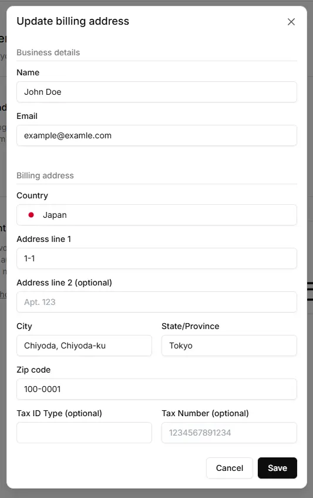
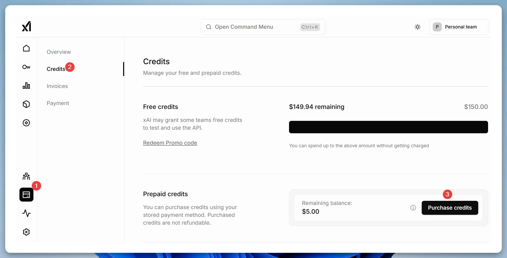
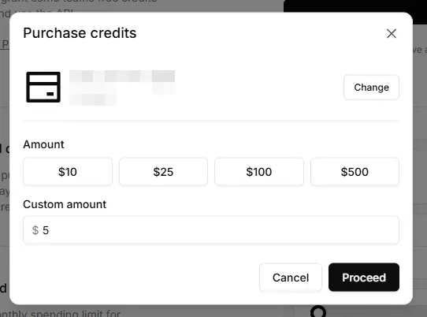
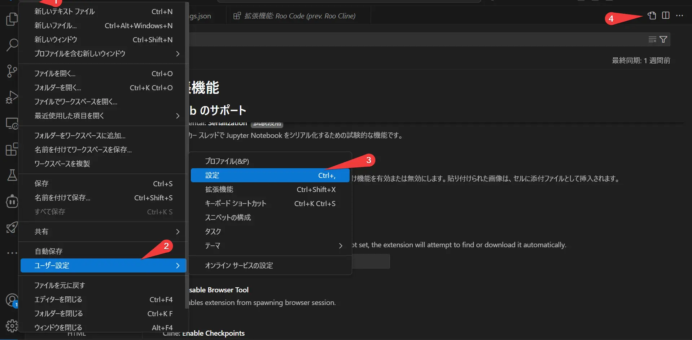
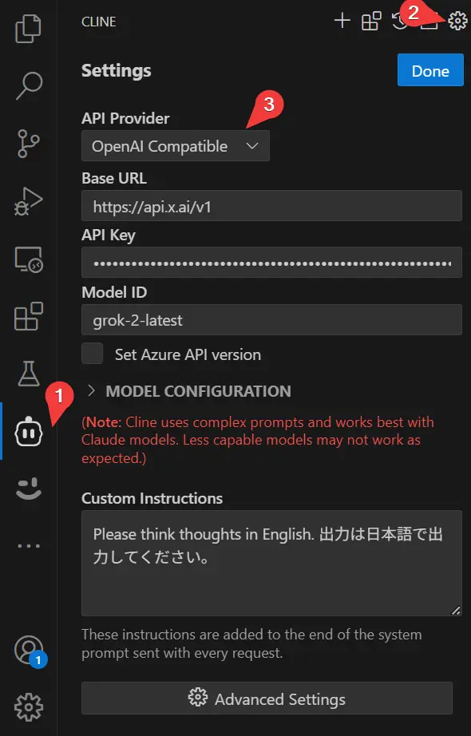
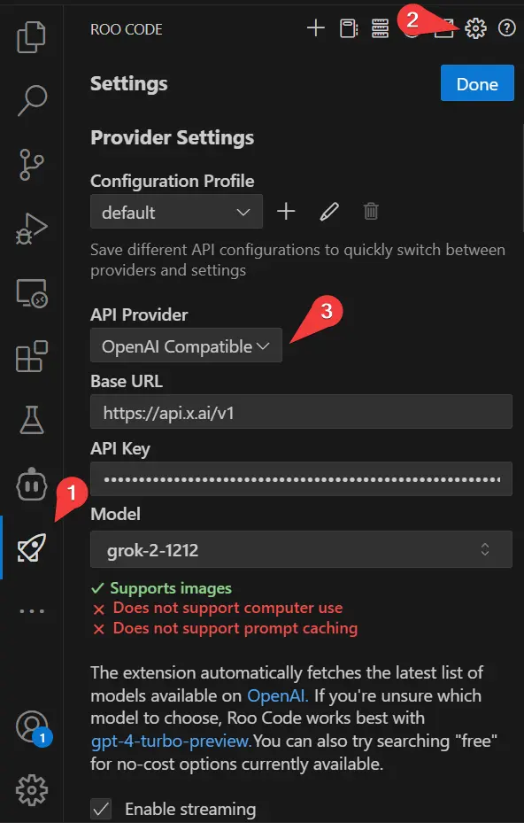

## 如何支付5美元给xAI并每月获得150美元的积分

我参考了以下文章注册了xAI：  
[Grok API：支付5美元即可使用150美元的额度？](https://zenn.dev/schroneko/articles/de3a8f574e9ea4)

首先，访问 [xAI Cloud Console](https://console.x.ai/)。

  

按图中1、2的顺序点击，输入“Billing address”（账单地址）。

  

图片仅为示例，我用英文填写。地址应与您的信用卡地址一致。  
“Tax ID Type”（税务ID类型）和“Tax Number”（税务号码）是可选的，我没有填写。  
这可能与税收有关，但我不太确定。  
接下来，输入“Payment methods”（支付方式）。

  

我使用的是PayPay的JCB卡，支付成功。（注：PayPay是日本流行的支付服务，但任何有效的信用卡都应该可以。在中国，您可以使用常见的信用卡或支持国际支付的其他方式。）  

  

有一个“Redeem Promo code”（兑换促销代码）的输入框，但截至2月20日，即使使用xAI的DeepResearch工具也找不到任何促销代码。可能目前没有可用的代码。  
点击“Purchase credits”（购买积分）来购买积分。

  

支付5美元即可。支付后，会出现“Share Data”（共享数据）按钮（我忘记截图了）。  
根据这篇文章，同意与xAI共享数据后，每月可以获得150美元的积分：  

[每月获得150美元的免费API积分](https://docs.x.ai/docs/data-sharing)

## 在VSCode扩展中使用xAI的方法

### 在Cody中使用Grok API

[Cody: AI Code Assistant](https://marketplace.visualstudio.com/items?itemName=sourcegraph.cody-ai) 是一个AI驱动的扩展，提供代码补全、编辑和聊天功能。  
代码补全始终免费，但代码编辑和聊天有使用次数限制。通过为编辑和聊天设置Grok API，您只需支付5美元即可无限制地使用AI编码功能。

  

如图所示，点击“文件”→“首选项”→“设置”，然后点击右上角的图标打开“settings.json”。  
或者，按“Ctrl” + “Shift” + P 并选择“Preferences: Open Settings (JSON)”。

以下是如何在`"cody.dev.models"`中设置您想要添加的模型。由于Grok是OpenAI兼容的API，因此将提供商指定为`"openai"`。  
此外，我还设置了DeepSeek和Gemini API。DeepSeek也是一种价格实惠的API，您可以使用它。  
Gemini是Google提供的API，可以免费使用。（由于连续使用有一定的限制，我使用了多个实例。）  
对于`"inputTokens"`、`"temperature"`和`"stream"`，我直接使用了官方示例中的设置。

```json
{
    "cody.dev.models": [
        {
            "provider": "openai", 
            "model": "grok-2-latest",
            "inputTokens": 131072,
            "outputTokens": 8192,
            "apiKey": "xai-xxxxxxxxxxxxxxxxxxxxxxxx",
            "options": {
                "temperature": 0,
                "stream": false
            },
            "apiEndpoint": "https://api.x.ai/v1"
        },
        {
            "provider": "groq",
            "model": "deepseek-chat",
            "inputTokens": 128000,
            "outputTokens": 8192,
            "apiKey": "sk-xxxxxxxxxxxxxxxxxxxxxxxx",
            "options": {
                "temperature": 0.6
            },
            "apiEndpoint": "https://api.deepseek.com/chat/completions"
        },
        {
            "provider": "google",
            "model": "gemini-2.0-pro-exp-02-05",
            "inputTokens": 2097152,
            "outputTokens": 8192,
            "apiKey": "AIxxxxxxxxxxxxxxxxxxxxxxxx",
            "options": {
              "temperature": 1.0
            }
        },
        {
            "provider": "google",
            "model": "gemini-2.0-flash-exp",
            "inputTokens": 1048576,
            "outputTokens": 8192,
            "apiKey": "AIxxxxxxxxxxxxxxxxxxxxxxxx",
            "options": {
              "temperature": 1.0
            }
        }
    ],
    
    "cody.edit.preInstruction": "Please think thoughts in English. 输出应为中文。",
    "cody.chat.preInstruction": "Please think thoughts in English. 输出应为中文。"
}
```

在代码编辑（"cody.edit.preInstruction"）和聊天（"cody.chat.preInstruction"）中，您可以设置类似于ChatGPT中的自定义提示。

### 在Cline中使用Grok API

[Cline](https://marketplace.visualstudio.com/items?itemName=saoudrizwan.claude-dev) 似乎是一个AI代理。它可以读写文件、新建文件以及执行命令。由于它与API进行多次交互，因此会消耗大量令牌。

  

Cline 可以通过如图所示的“OpenAI Compatible”选项进行设置。设置完成后，点击“Done”保存。

### 在Roo Code中使用Grok API

[Roo Code（前身为Roo Cline）](https://marketplace.visualstudio.com/items?itemName=RooVeterinaryInc.roo-cline) 是Cline的一个分支，提供更快的更新和更多功能。

  

Roo Code 也可以通过如图所示的“OpenAI Compatible”选项进行设置。设置完成后，点击“Done”保存。