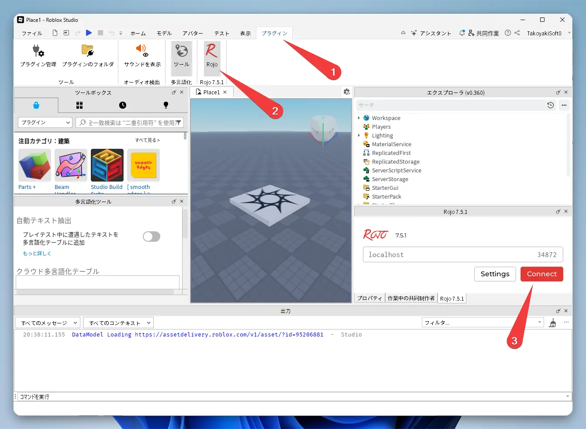

# GitHub Template

[roblox-rojo-wally-template](https://github.com/takoyakisoft/roblox-rojo-wally-template)

# What is this?

This is a template for a modern development environment using VSCode for Roblox (Luau).

- Syncing from VSCode 👉 Roblox Studio: [Rojo](https://github.com/rojo-rbx/rojo)
- Linter: [Selene](https://github.com/Kampfkarren/selene)
- Formatter: [StyLua](https://github.com/JohnnyMorganz/StyLua)
- Package Manager: [Wally](https://github.com/UpliftGames/wally)
- Manager for Rojo and Wally: [Rokit](https://github.com/rojo-rbx/rokit)


This template does not include CI/CD: [CI/CD Demo](https://github.com/Roblox/place-ci-cd-demo)


# Installation


You can use this template by clicking the "Use this template" button on the [roblox-rojo-wally-template](https://github.com/takoyakisoft/roblox-rojo-wally-template) repository.


## Install Rokit

Windows (PowerShell)

```powershell
Invoke-RestMethod https://raw.githubusercontent.com/rojo-rbx/rokit/main/scripts/install.ps1 | Invoke-Expression
```

macOS / Linux

```bash
curl -fsSL https://raw.githubusercontent.com/rojo-rbx/rokit/main/scripts/install.sh | sh
```

## Install Rojo, Wally, etc.

```bash
rokit add rojo
rokit add wally
rokit add wally-package-types
```

## Install Packages

```bash
wally install
rojo sourcemap default.project.json --output sourcemap.json
wally-package-types -s sourcemap.json Packages/
wally-package-types -s sourcemap.json ServerPackages/
wally-package-types -s sourcemap.json DevPackages/
```

## Install VSCode Extensions

When you open this project in VSCode, you will be prompted to install the following extensions. Please install them.

- [Rojo](https://marketplace.visualstudio.com/items?itemName=evaera.vscode-rojo)
- [Luau Language Server](https://marketplace.visualstudio.com/items?itemName=JohnnyMorganz.luau-lsp)
- [Selene](https://marketplace.visualstudio.com/items?itemName=Kampfkarren.selene-vscode)
- [StyLua](https://marketplace.visualstudio.com/items?itemName=JohnnyMorganz.stylua)

# Usage

## Rojo from VSCode

Press `Ctrl + Shift + P`

Select `Rojo: Open Menu`


If this is your first time, launch Roblox Studio and then click "Install Roblox Studio Plugin".


Select `▶ default.project.json`


## Rojo from Roblox Studio

Go to the "Plugins" tab.

Find the "Rojo" ribbon.

Click the "Connect" button.



## Add a package with Wally

Edit `wally.toml` in VSCode.

Go to the [wally.run](https://wally.run/) website, find the package you want, and copy its name from the "Install" section.

The sections are categorized as follows:

`[dependencies]` for both client and server
`[server-dependencies]` for server-only
`[dev-dependencies]` for development and testing only

After editing the file, run the [package installation](#install-packages) steps again.

# Reference

