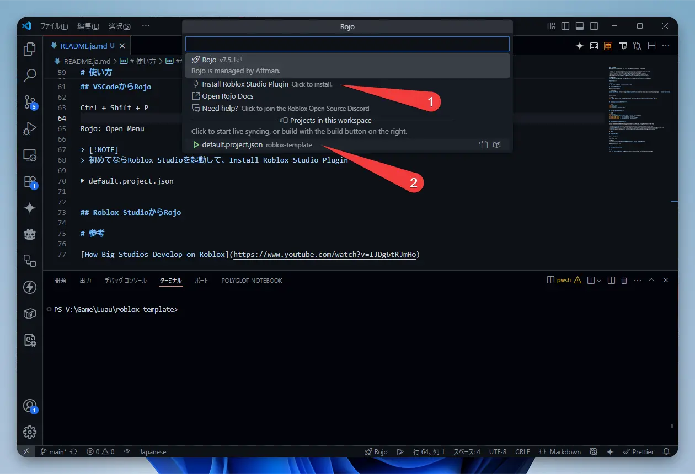

# GitHubテンプレート

[roblox-rojo-wally-template](https://github.com/takoyakisoft/roblox-rojo-wally-template)

# これは何？

Roblox（Luau）でVSCodeを使ったモダンな開発環境のテンプレートです。

- VSCode 👉 Roblox Studioへの同期: [Rojo](https://github.com/rojo-rbx/rojo)
- リンター: [Selene](https://github.com/Kampfkarren/selene)
- フォーマッター: [StyLua](https://github.com/JohnnyMorganz/StyLua)
- パッケージマネージャー: [Wally](https://github.com/UpliftGames/wally)
- RojoとWallyのマネージャー:　[Rokit](https://github.com/rojo-rbx/rokit)


CI/CDは入ってないです: [CI/CD](https://github.com/Roblox/place-ci-cd-demo)


# インストール


[roblox-rojo-wally-template](https://github.com/takoyakisoft/roblox-rojo-wally-template)リポジトリの"Use this template"ボタンから使えます。


## Rokitのインストール

Windows (PowerShell)

```powershell
Invoke-RestMethod https://raw.githubusercontent.com/rojo-rbx/rokit/main/scripts/install.ps1 | Invoke-Expression
```

macOS / Linux

```bash
curl -fsSL https://raw.githubusercontent.com/rojo-rbx/rokit/main/scripts/install.sh | sh
```

## RojoやWallyなどのインストール

```bash
rokit add rojo
rokit add wally
rokit add wally-package-types
```

## パッケージのインストール

```bash
wally install
rojo sourcemap default.project.json --output sourcemap.json
wally-package-types -s sourcemap.json Packages/
wally-package-types -s sourcemap.json ServerPackages/
wally-package-types -s sourcemap.json DevPackages/
```

## VSCode拡張機能のインストール

このプロジェクトを開くとVSCodeで以下の拡張機能が表示されるのでインストールします。

- [Rojo](https://marketplace.visualstudio.com/items?itemName=evaera.vscode-rojo)
- [Luau Language Server](https://marketplace.visualstudio.com/items?itemName=JohnnyMorganz.luau-lsp)
- [Selene](https://marketplace.visualstudio.com/items?itemName=Kampfkarren.selene-vscode)
- [StyLua](https://marketplace.visualstudio.com/items?itemName=JohnnyMorganz.stylua)

# 使い方

## VSCodeからRojo

「Ctrl + Shift + P」

「Rojo: Open Menu」


初めてならRoblox Studioを起動してから、Install Roblox Studio Plugin


「▶ default.project.json」



## Roblox StudioからRojo

「プラグイン」タブ

「Rojo」リボン

「Connect」ボタン


## Wallyにパッケージを追加

wally.tomlをVSCodeで編集します。

[wally.run](https://wally.run/)のサイトで欲しいパッケージを調べて「Install」でパッケージ名をコピーします。

各セクションの分類は

[dependencies]がクライアントとサーバー

[server-dependencies]がサーバーのみ

[dev-dependencies]が開発やテストのみ

書き終えたら、再度[パッケージのインストール](#パッケージのインストール)を行います。

# 参考


