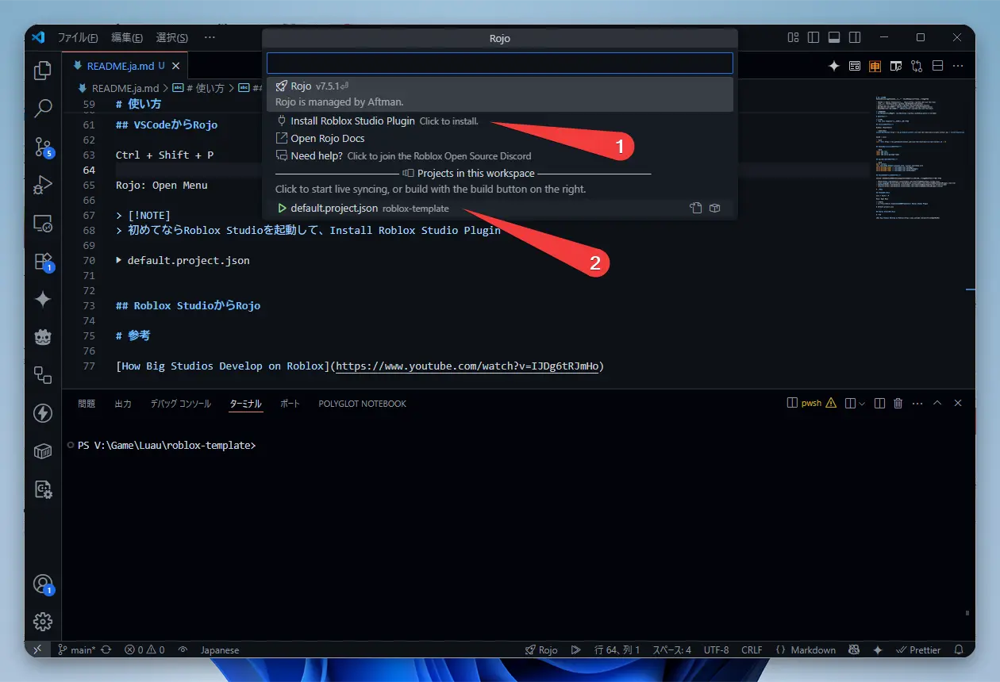

# GitHub 模板

[roblox-rojo-wally-template](https://github.com/takoyakisoft/roblox-rojo-wally-template)

# 这是什么？

这是一个使用 VSCode 为 Roblox (Luau) 进行开发的现代开发环境模板。

- 从 VSCode 同步到 Roblox Studio: [Rojo](https://github.com/rojo-rbx/rojo)
- 代码检查器 (Linter): [Selene](https://github.com/Kampfkarren/selene)
- 代码格式化器 (Formatter): [StyLua](https://github.com/JohnnyMorganz/StyLua)
- 包管理器 (Package Manager): [Wally](https://github.com/UpliftGames/wally)
- Rojo 和 Wally 的管理器: [Rokit](https://github.com/rojo-rbx/rokit)

> [!WARNING]
> 不包含 CI/CD: [CI/CD](https://github.com/Roblox/place-ci-cd-demo)

# 安装

> [!TIP]
> 您可以通过点击 “Use this template” 按钮来使用。

## 安装 Rokit

Windows (PowerShell)

```powershell
Invoke-RestMethod https://raw.githubusercontent.com/rojo-rbx/rokit/main/scripts/install.ps1 | Invoke-Expression
```

macOS / Linux

```bash
curl -fsSL https://raw.githubusercontent.com/rojo-rbx/rokit/main/scripts/install.sh | sh
```

## 安装 Rojo、Wally 等工具

```bash
rokit add rojo
rokit add wally
rokit add wally-package-types
```

## 安装包

```bash
wally install
rojo sourcemap default.project.json --output sourcemap.json
wally-package-types -s sourcemap.json Packages/
wally-package-types -s sourcemap.json ServerPackages/
wally-package-types -s sourcemap.json DevPackages/
```

## 安装 VSCode 扩展

在 VSCode 中打开此项目时，会提示安装以下扩展，请进行安装。

- [Rojo](https://marketplace.visualstudio.com/items?itemName=evaera.vscode-rojo)
- [Luau Language Server](https://marketplace.visualstudio.com/items?itemName=JohnnyMorganz.luau-lsp)
- [Selene](https://marketplace.visualstudio.com/items?itemName=Kampfkarren.selene-vscode)
- [StyLua](https://marketplace.visualstudio.com/items?itemName=JohnnyMorganz.stylua)

# 使用方法

## 从 VSCode 启动 Rojo

“Ctrl + Shift + P”

“Rojo: Open Menu”

> [!NOTE]
> 如果是首次使用，请启动 Roblox Studio 并安装 Roblox Studio 插件（Install Roblox Studio Plugin）。

“▶ default.project.json”



## 从 Roblox Studio 连接 Rojo

“插件” (Plugins) 选项卡

“Rojo” 功能区

“Connect” 按钮


## 向 Wally 添加包

在 VSCode 中编辑 wally.toml 文件。

请访问 [wally.run](https://wally.run/) 网站，查找您需要的包，并通过“Install”复制其名称。

各个部分的分类如下：

[dependencies] 用于客户端和服务器

[server-dependencies] 仅用于服务器

[dev-dependencies] 仅用于开发和测试

编辑完成后，请再次执行[安装包](#安装包)的步骤。

# 参考资料

[How Big Studios Develop on Roblox](https://www.youtube.com/watch?v=IJDg6tRJmHo)