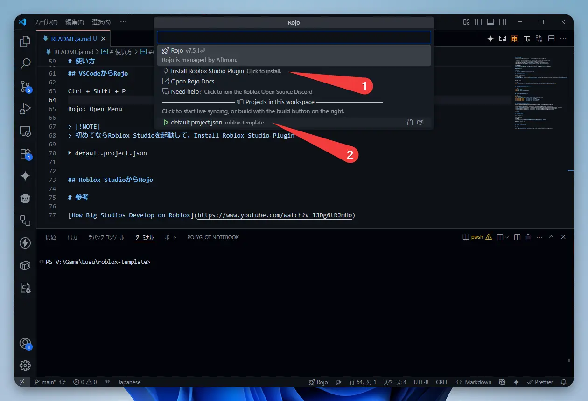
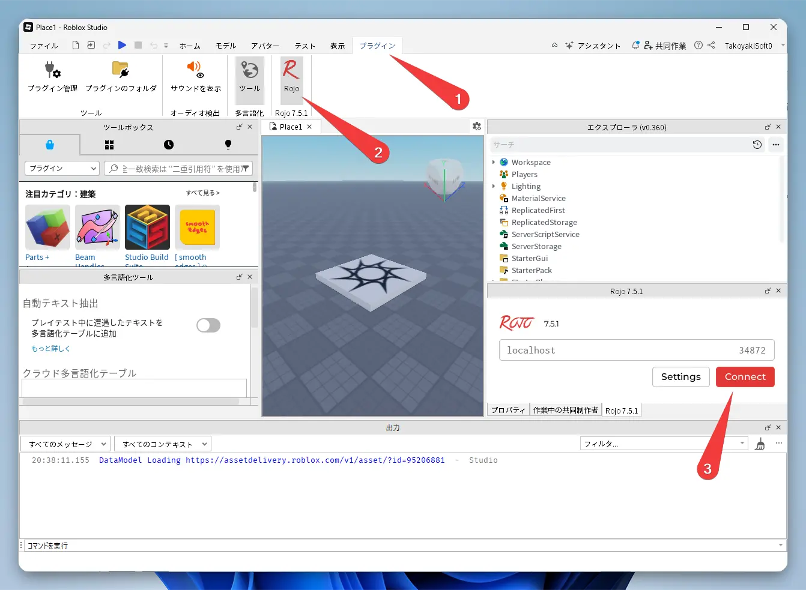

# GitHub Template

[roblox-ts-rojo-template](https://github.com/takoyakisoft/roblox-ts-rojo-template)

[English](README.md) [日本語](README.ja.md)

# What is this?

This is a template for a modern development environment using VSCode for Roblox (TypeScript).

- VSCode 👉 Roblox Studio sync: [Rojo](https://github.com/rojo-rbx/rojo)
- Linter: [ESlint](https://github.com/eslint/eslint)
- Formatter: [Prettier](https://github.com/prettier/prettier)
- Package Manager: [pnpm](https://github.com/pnpm/pnpm)

> [!CAUTION]
> Functionality is unconfirmed, but popular packages have been included.

- "@rbxts/janitor"
- "@rbxts/knit"
- "@rbxts/profileservice"
- "@rbxts/replicaservice"
- "@rbxts/react"
- "@rbxts/react-roblox"
- "@rbxts/cmdr"
- "@rbxts/testez"

> [!WARNING]
> CI/CD is not included.

# Installation

> [!TIP]
> You can use this via the "Use this template" button.

## Install Packages

```bash
pnpm install
```

## Install VSCode Extensions

When you open this project, VSCode will recommend the following extensions. Please install them.

- [roblox-ts](https://marketplace.visualstudio.com/items?itemName=Roblox-TS.vscode-roblox-ts)
- [ESLint](https://marketplace.visualstudio.com/items?itemName=dbaeumer.vscode-eslint)
- [Prettier](https://marketplace.visualstudio.com/items?itemName=esbenp.prettier-vscode)
- [Rojo](https://marketplace.visualstudio.com/items?itemName=evaera.vscode-rojo)

# Usage

## From VSCode to Rojo

```bash
pnpm run watch
```

`Ctrl + Shift + P`

`Rojo: Open Menu`

> [!NOTE]
> If this is your first time, launch Roblox Studio and install the Roblox Studio Plugin.

`▶ default.project.json`



## From Roblox Studio to Rojo

"Plugins" tab

"Rojo" ribbon

"Connect" button

