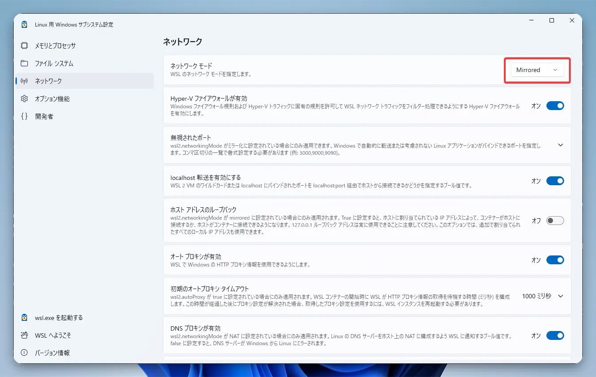
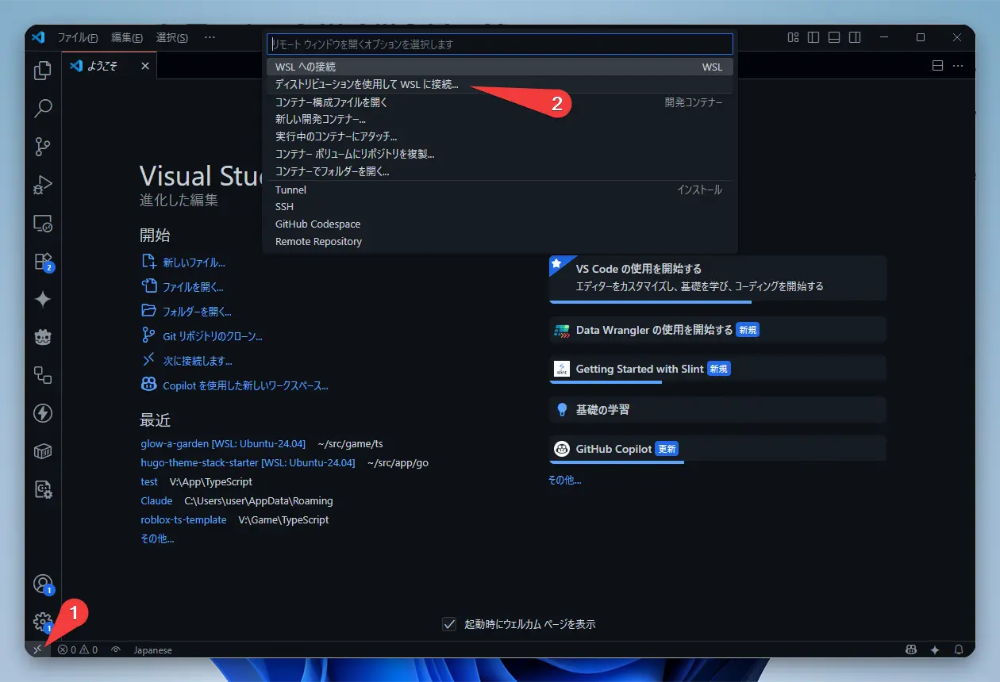
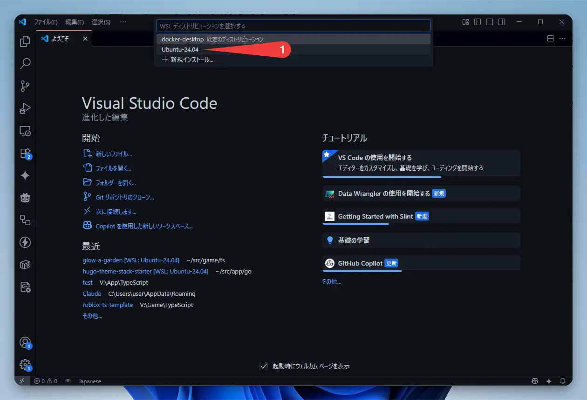
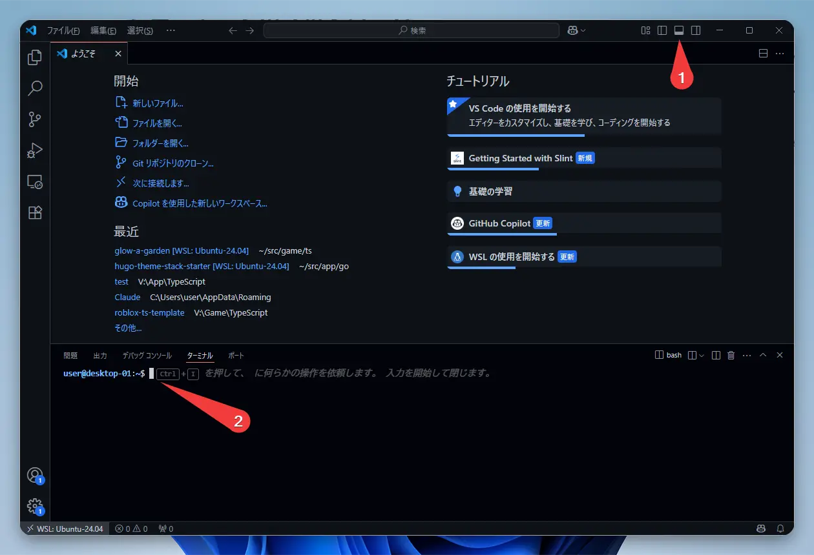
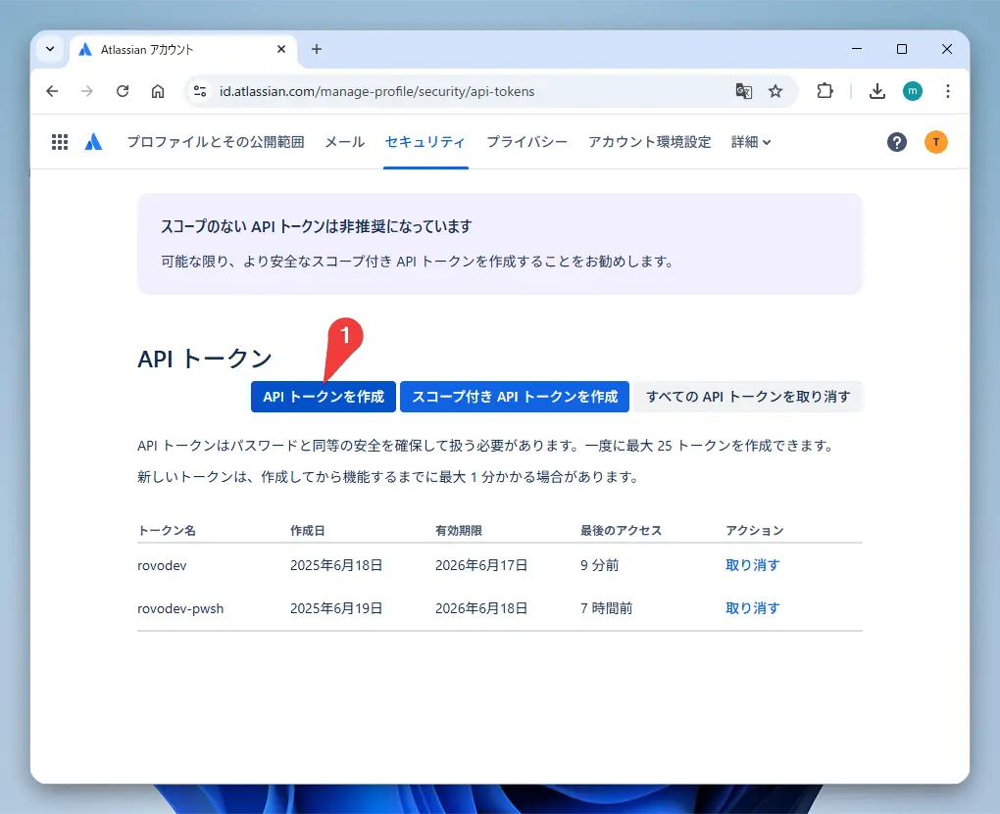
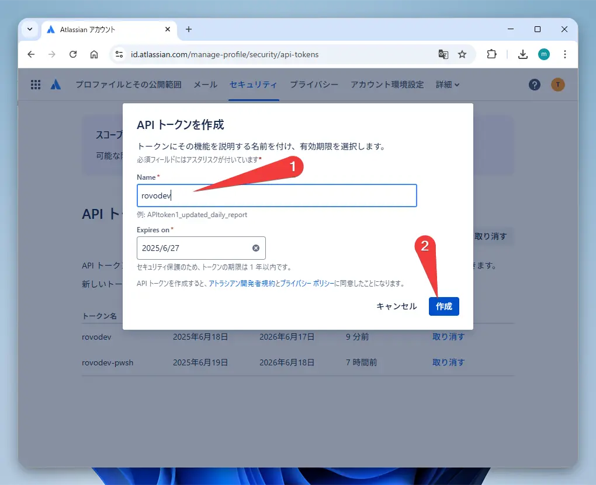
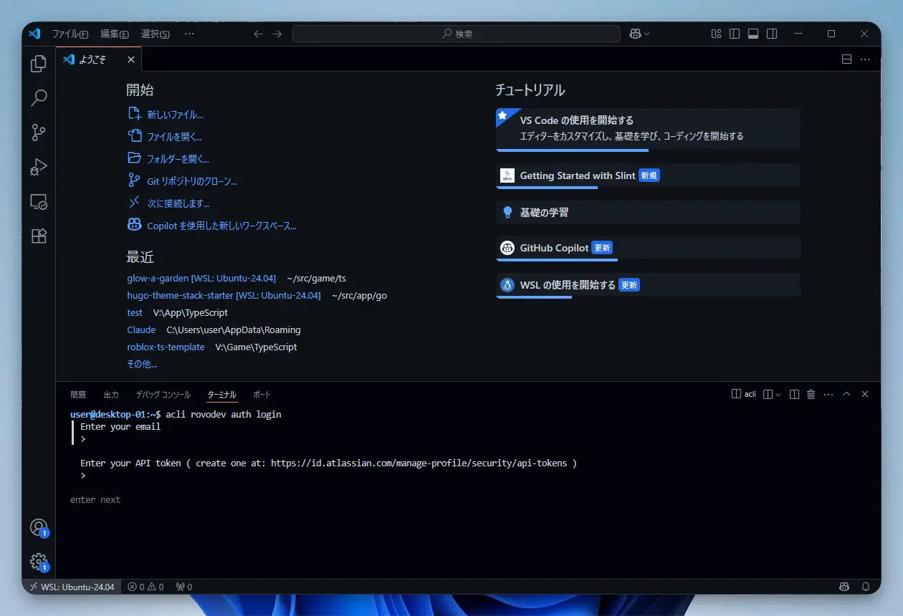
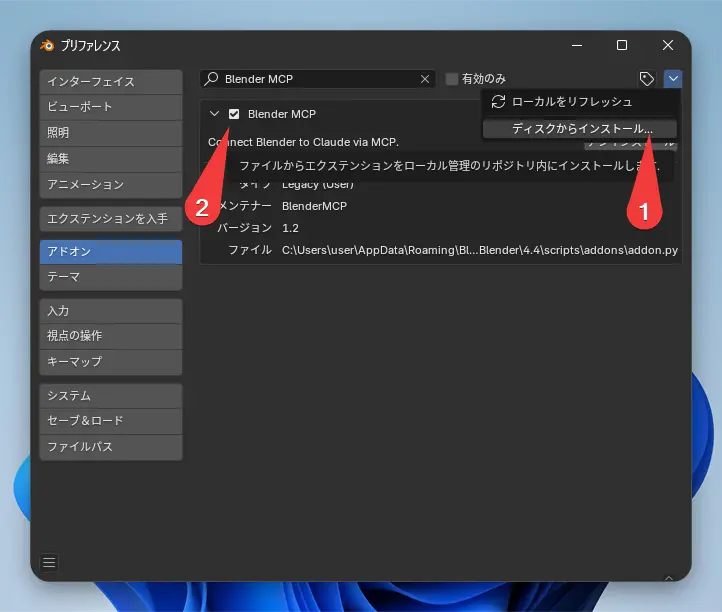
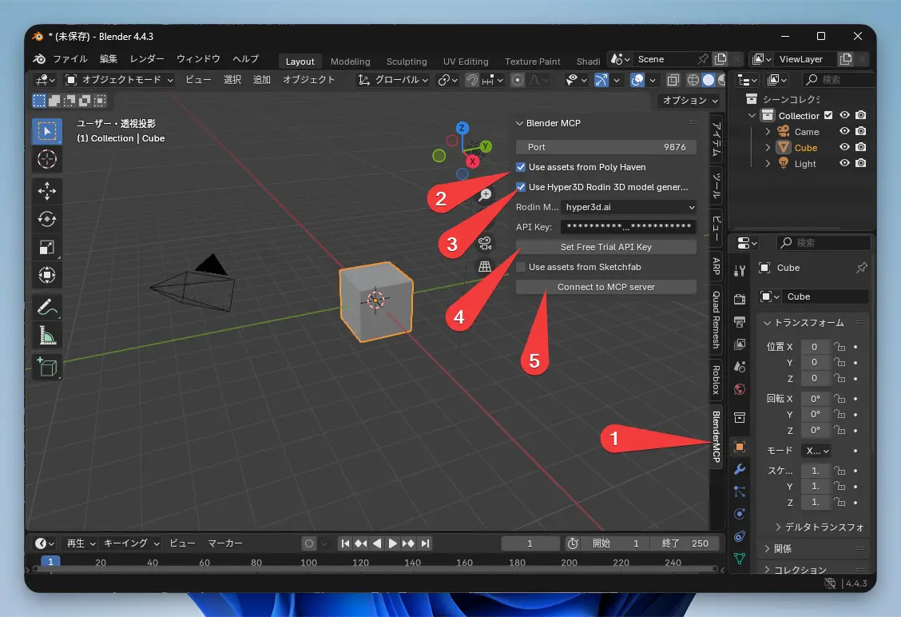

Hello there!

By the way, I'm even using Rovo Dev CLI's AI assistant feature to write this article. Pretty handy, right?

Today, I'm going to walk you through Atlassian's AI development agent, "Rovo Dev CLI."

It's a tool similar to the popular "Claude Code." You can use it in your terminal to chat with an AI, get help with coding, generate tests, ask for refactoring, and much more. And the best part? It's currently free to use during its beta period.

However, if you try to use it directly in Windows PowerShell, you'll run into issues with garbled Japanese characters...

But don't worry!
In this article, I'll cover everything from the basic usage to a slick solution for that garbled text problem using "WSL2" and "VSCode." We'll even dive into an advanced "MCP integration" technique that lets you command an AI to perform 3D modeling. I'll provide concrete steps for everything.

### What is Rovo Dev CLI?

Rovo Dev CLI is a command-line AI assistant developed by Atlassian, the company famous for Jira and Confluence.

When I asked Rovo Dev itself, "What model are you using?", it told me it uses Anthropic's Claude family.

### For Windows Users: Start Here! WSL2 Setup

If you're using Rovo Dev CLI on Windows, I strongly recommend using WSL2 (Windows Subsystem for Linux 2).
As I mentioned earlier, this is because using it directly in PowerShell can lead to garbled Japanese text.

#### WSL2 Installation and Configuration

1.  Install WSL2

Open "PowerShell" and run this command.

```powershell
wsl --install -d Ubuntu-24.04
```

In my environment, I had to restart my PC for WSL to start up correctly. If you run into trouble, give that a try.

2.  WSL2 Initial Setup

Once the installation is complete, Ubuntu will launch. Set up your username and password.

3.  Set Up Convenient Mirrored Networking Mode

By configuring WSL2's new "mirrored" mode, the network is shared between Windows and WSL2, allowing you to access `localhost` from either side.
This will be incredibly useful for the MCP integration I'll explain later.

Create a file named `.wslconfig` in your Windows user folder (`C:\Users\your-username`) and add the following content.

```ini
[wsl2]
networkingMode=mirrored
```

You can also do the same from the "WSL Settings" menu.



4.  Restart WSL2

To apply the settings, run this command in PowerShell.

```powershell
wsl --shutdown
```

After that, start WSL2 (Ubuntu) again.

Now your WSL2 environment is all set!
In the next step, we'll connect to this WSL2 environment from VSCode to make things even more comfortable.

### Let's Connect to WSL2 from VSCode

From here on out, we'll be doing everything using the VSCode WSL extension.

#### VSCode WSL Extension Installation and Connection Steps

1.  Install VSCode

If you haven't already, download and install it from the [official website](https://code.visualstudio.com/).

2.  Install the WSL Extension

Launch VSCode, go to the Extensions tab on the left (Ctrl+Shift+X), search for "WSL," and install it.

3.  Connect to WSL2

Click the green icon in the bottom-left corner of the VSCode window and select "Connect to WSL using Distro...".


4.  Select Ubuntu-24.04

Choose the Ubuntu-24.04 distribution we just installed.



5.  Open the Terminal

Go to the VSCode menu and select "Terminal" -> "New Terminal," or use the shortcut `` Ctrl+` `` to open the terminal.
You can also open it as shown in the image.


Now you're ready to access WSL2's Ubuntu from within VSCode!
Let's perform all subsequent operations in this VSCode terminal.
Editing and creating files is also a breeze since you can use the VSCode editor.

### Installation and Initial Setup

1.  Install ACLI (Atlassian CLI)

Rovo Dev is used via ACLI, Atlassian's common tool. First, let's install it on our WSL2 Ubuntu.

```bash
# Install required packages
sudo apt-get install -y wget gnupg2

# Set up the APT repository
# Create directory for the key
sudo mkdir -p -m 755 /etc/apt/keyrings
# Download the public key and convert it to GPG format
wget -nv -O- https://acli.atlassian.com/gpg/public-key.asc | sudo gpg --dearmor -o /etc/apt/keyrings/acli-archive-keyring.gpg
# Set permissions for the key file
sudo chmod go+r /etc/apt/keyrings/acli-archive-keyring.gpg
# Add the repository information to APT's configuration
echo "deb [arch=$(dpkg --print-architecture) signed-by=/etc/apt/keyrings/acli-archive-keyring.gpg] https://acli.atlassian.com/linux/deb stable main" | sudo tee /etc/apt/sources.list.d/acli.list > /dev/null

# Install ACLI
sudo apt update
sudo apt install -y acli
```

If you're using a different OS, you can find instructions on the official [Install and update](https://developer.atlassian.com/cloud/acli/guides/install-acli/) page.

2.  Get an Atlassian API Token and Authenticate

Next, let's get an API token to log in with your Atlassian account.

1.  Go to your [Atlassian ID profile](https://id.atlassian.com/manage-profile/security/api-tokens).
2.  Click "Create API token" and create a token with a descriptive name (e.g., `rovo-dev-cli`).



3.  The generated token is only displayed once, so be sure to copy and save it somewhere safe!



Once you have the token, run this command in the terminal to authenticate.

```bash
acli rovodev auth login
```

Enter your email address and paste the API token you just copied to complete the authentication.



3.  Launch!

Alright, it's finally time to start the AI agent.

```bash
acli rovodev run
```

Running this will switch your terminal to an interactive chat mode with the AI. How exciting!

### Good to Know! Basic Usage

Rovo Dev CLI is packed with features that will make your development work much easier.

#### Custom Prompts (Custom Instructions)

Repeating the same requests every time can be a bit tedious. That's where custom prompts come in handy. You can give the AI background knowledge in advance, similar to the `CLAUDE.md` file in the Claude desktop app.

There are three ways to set this up:

1.  Global Config File
    Write your instructions in `~/.rovodev/config.yml`. These are system-wide instructions.

```yaml
additionalSystemPrompt: |
  You are an expert in Python and TypeScript.
  When writing code, always include tests.
  Provide explanations concisely and in English.
```

2.  Global Agent File
    Write instructions for the AI to read in a file called `~/.rovodev/.agent.md`. Since it's Markdown, you can be more detailed.

```markdown
# Developer Guidelines

## Coding Style
- Use 2 spaces for indentation.
- Function names should be in camelCase.
- Class names should be in PascalCase.

## Testing Policy
- Unit tests are mandatory.
- Use mocks to speed up tests.
```

3.  Project-Specific Instructions
    Create an `.agent.md` file in the root of your current repository. This is useful for writing rules to be shared with your team. For personal settings, I recommend using `.agent.local.md`, which you can exclude from Git version control.

```markdown
# Project-Specific Guidelines

This project is a web application using Next.js and TypeScript.

## Architecture
- pages/ - Page components for routing
- components/ - Reusable UI components
- lib/ - Utility functions and helpers
- styles/ - CSS modules and global styles

## Development Rules
- Create components as functional components.
- Use React Hooks for state management.
- Use SWR for API requests.
```

You can combine all these settings, and the AI will consider all instructions when responding. Writing effective custom instructions will help you get higher-quality answers from the AI.

#### Example Commands

In interactive mode, you can make requests like these:

*   `summarize this file ./path/to/file.js`: Summarize this file!
*   `add unit tests for UserService`: Write unit tests for UserService!
*   `Refactor this complex function to be more readable`: Rewrite this complex function to be more readable!

The AI understands your directory structure, so it can grasp the context just by being given a file path, which is pretty smart.

#### List of Useful Interactive Mode Commands

Interactive mode has many other useful commands to make your interactions with the AI even smoother. If you want to know more about a specific command, just type `/command-name help` in interactive mode.

#### Session Management: `/sessions`

This command manages your sessions. It's incredibly useful because it allows you to separate conversation histories and contexts.

*   Key Features:
    *   Session Management: Create and switch between multiple conversation sessions.
    *   Context Persistence: Each session remembers its own conversation history.
    *   Workspace Isolation: You can separate sessions by project.
    *   Session Forking: You can even branch off from the current conversation to create a new session.

When you restart Rovo Dev CLI with the `--restore` option, it will automatically restore your previous session.

#### Clear Session: `/clear`

This command erases the entire conversation history of the current session, resetting it to a blank slate. Be careful, as this action cannot be undone. If you want to keep the history, use the `/sessions` command to create a new session or the `/prune` command, which I'll introduce next.

#### Optimize Session: `/prune`

Use this when your conversation starts getting long. It's a smart command that saves tokens by trimming the history while keeping the important parts. It removes things like the results of tools (programs) executed by the AI to slim down the history.

#### Pre-defined Instruction Templates: `/instructions`

This allows you to run pre-defined instruction templates for common tasks like code reviews or documentation writing.

*   Built-in Instruction Templates:
    *   Code review and analysis
    *   Documentation generation and improvement
    *   Unit test creation and coverage improvement
    *   Confluence page summarization
    *   Jira issue analysis

You can also create your own custom templates!

1.  Create an `instructions.yml` file in `.rovodev/`.
2.  Create a Markdown file with the instruction content inside the `.rovodev` folder.

To use them, just type `/instructions` to see a list of templates.

#### Memory Management: `/memory`

This feature lets you have Rovo Dev CLI remember important information about your projects and settings.

*   Types of Memory:
    *   Project Memory: Saved in the current directory (`.agent.md` and `.agent.local.md`).
    *   User Memory: Saved globally in your home directory (`~/.rovodev/agent.md`).

Memory files are in Markdown format, and they're useful for writing down project rules, coding conventions, and so on.
You can quickly add a note by typing something like `# Here's something to remember`.

#### Feedback: `/feedback`

A command for sending feedback or bug reports about Rovo Dev CLI.

#### Usage: `/usage`

Check your LLM token usage for the day. Make sure you're not overdoing it!

#### Exit: `/exit`

Exits the application. `/quit` or `/q` also work.

### [Advanced] Integration Between WSL2 and Windows

Thanks to the VSCode WSL extension, file sharing and application integration between WSL2 and Windows become incredibly smooth.

#### Utilizing Mirrored Networking Mode

The WSL2 mirrored networking mode we set up earlier really shines here.

1.  Port Sharing: You can directly access a server running in WSL2 (e.g., `localhost:3000`) from a browser on Windows.
2.  Shared Network Services: You can use services on the same network from both Windows and WSL2.
3.  Integration with MCP Server: This feature is especially crucial for the MCP integration we'll discuss next. It allows Rovo Dev CLI in WSL2 to seamlessly connect to the Blender MCP server running on Windows.

This integration lets you get the best of both worlds: the user-friendly interface of Windows and the powerful command line of Linux.

### [Advanced] Let's Make AI Control Blender with MCP!

Time for the grand finale! Let's use Rovo Dev's powerful MCP (Model Context Protocol) feature to control Blender on Windows from WSL2. We'll be using a handy open-source tool called [BlenderMCP](https://github.com/ahujasid/blender-mcp).

#### What is BlenderMCP?

BlenderMCP is a tool that connects AI with Blender. With it, the AI can directly control Blender to perform 3D modeling, create scenes, manipulate objects, and more!

Key Features:
- Bidirectional Communication: Connects AI and Blender.
- Object Manipulation: Create, move, and delete objects.
- Material Control: Apply colors and set textures.
- Scene Inspection: The AI can check the current state of the Blender scene.
- Code Execution: The AI can send and execute Python code in Blender.

#### Setup Steps

BlenderMCP consists of two parts:

1.  Windows Side: Blender Add-on (`addon.py`): Installed in Blender on Windows.
2.  WSL2 Side: MCP Server: Installed on WSL2's Ubuntu and used by Rovo Dev CLI.

Let's get it set up!

1.  Windows Side: Install the Blender Add-on
    - Download `addon.py` from the [BlenderMCP GitHub repository](https://github.com/ahujasid/blender-mcp).
    - Open Blender, go to "Edit" > "Preferences" > "Add-ons."
    - Click "Install..." and select the `addon.py` file you downloaded.
    - Enable the add-on by checking the box next to "Blender MCP."

    

2.  WSL2 Side: Install the uv Package Manager
    - In your WSL2 Ubuntu terminal, run this command:
    ```bash
    # Install the uv package manager
    curl -LsSf https://astral.sh/uv/install.sh | sh
    ```

3.  WSL2 Side: Configure Rovo Dev CLI
    - Let's use VSCode to edit the configuration file:
    ```bash
    export EDITOR="code"
    acli rovodev mcp
    ```
    - This will open the configuration file in VSCode. Add the following content. This setting tells Rovo Dev CLI to automatically start BlenderMCP when it launches.
    ```json
    {
      "mcpServers": {
        "blender": {
          "command": "uvx",
          "args": ["blender-mcp"]
        }
      }
    }
    ```

4.  Windows Side: Configure Connection in Blender
    - In Blender, open the 3D View's sidebar (press the N key if it's not visible).
    - Find the "BlenderMCP" tab and click "Connect to MCP server."

    

5.  WSL2 Side: Control Blender with Rovo Dev CLI!
    - In your VSCode integrated terminal on WSL2, run `acli rovodev run`.
    - Try asking the AI something like this:

    ```
    Using Blender, please create a cat.
    ```

    And what happens? A cube should appear in your Blender window (running on Windows) and then move upwards, all based on the command from WSL2. This is the power of the mirrored networking we set up earlier. WSL2 recognizes Blender running on Windows as a server on `localhost`, enabling seamless integration. Amazing!

    

#### MCP Troubleshooting

If things aren't working, check these points:

1.  Connection Issues: Is the Blender add-on enabled? Did you click "Connect to MCP server" in Blender's MCP tab?
2.  WSL2 Mirrored Networking: Double-check that mirrored mode is properly enabled.
3.  Try a Restart: If connection errors persist, restarting both Rovo Dev CLI and Blender might be the quickest fix.
4.  Command Execution: Do not run the `uvx blender-mcp` command directly. Rovo Dev CLI runs it automatically based on the configuration file.

The most crucial thing is that the network connection between WSL2 and Windows is correctly set up with mirrored mode.

### Summary

In this article, we covered a wide range of topics, from the basics of Atlassian's new AI development tool, "Rovo Dev CLI," to tips for Windows users to use it comfortably with WSL2, and even an advanced Blender integration using MCP.

The initial setup might seem a bit involved, but once your environment is configured, the development experience of receiving powerful AI support without ever leaving your terminal is truly revolutionary.

Rovo Dev CLI is still in beta, so I'm excited to see how it will continue to evolve.
I hope this article helps you discover a new style of development.

Give this futuristic tool a try. Happy coding! 🎉