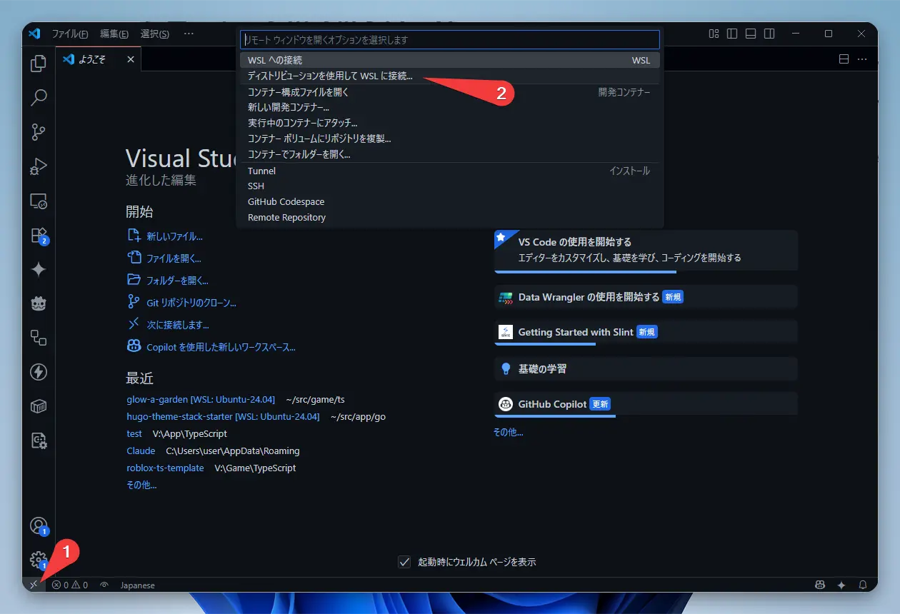
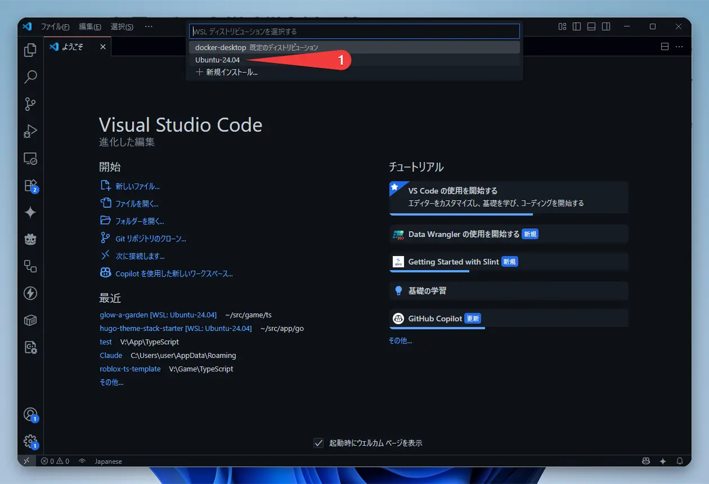
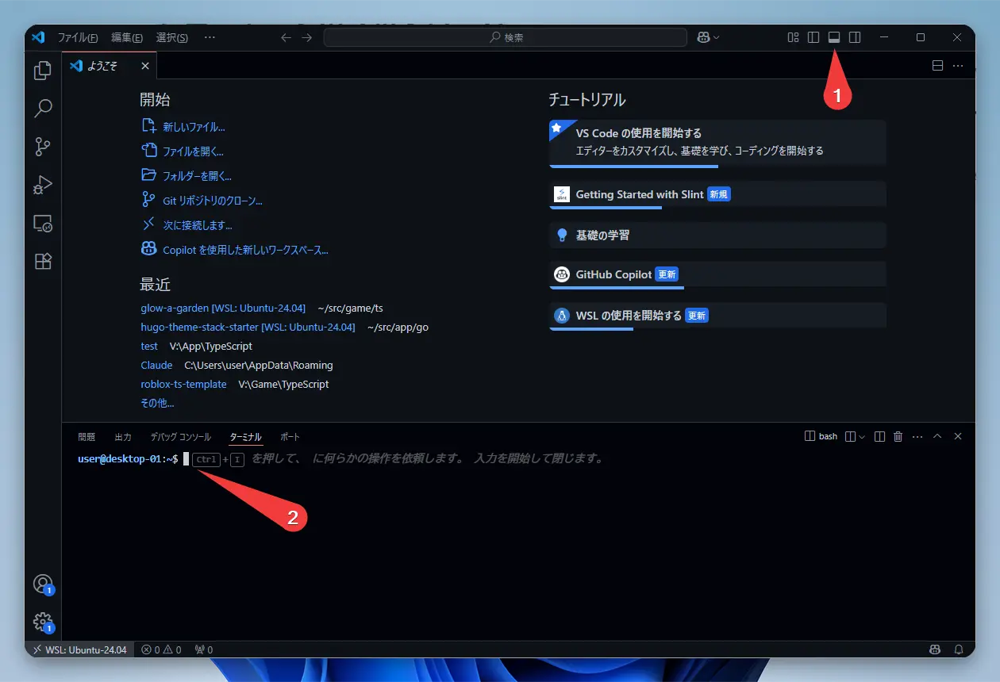
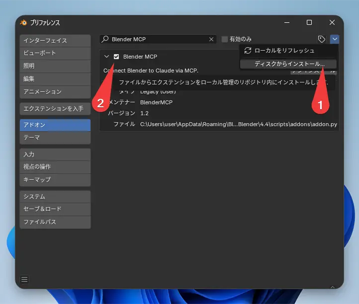

こんにちは！

ちなみに、この記事もRovo Dev CLIのAIアシスタント機能を使って書いてるんですよ。便利ですよね！

今回はAtlassianが作った開発AIエージェント「Rovo Dev CLI」について解説していこうと思います。

これは人気の「Claude Code」みたいなツールです。ターミナル上でAIとおしゃべりしながら、コーディングを手伝ってもらったり、テストを作ってもらったり、リファクタリングをお願いしたり、色々なことに使えます。しかも今はベータ期間中なので無料で利用できるんです。

ただ、WindowsのPowerShellでそのまま使うと、日本語が文字化けしちゃうんですよね…。

でも大丈夫です！
この記事では基本的な使い方から、その文字化け問題を「WSL2」と「VSCode」を使って華麗に解決する方法、さらにはAIに3Dモデリングを指示できてしまう「MCP連携」まで、具体的な手順を交えてご紹介します。

### Rovo Dev CLIって、なあに？

Rovo Dev CLIはJiraやConfluenceで有名なAtlassianが開発した、コマンドラインで使えるAIアシスタントです。

Rovo Dev本人に「どのモデルを使ってるの？」って聞いてみたら、Anthropic社のClaudeファミリーを使っているとのことでした。

### Windowsユーザーの方はまずここから！WSL2のセットアップ

WindowsでRovo Dev CLIを使うなら、WSL2 (Windows Subsystem for Linux 2) を使うのが断然おすすめです。
さっきもお話しした通り、PowerShellで直接使うと日本語が文字化けしてしまうからなんです。

#### WSL2のインストールと設定

1.  WSL2のインストール

「PowerShell」を開いて、このコマンドを実行します。

```powershell
wsl --install -d Ubuntu-24.04
```

私の環境だと、一度PCを再起動しないとWSLがうまく起動しませんでした。もし動かなかったら試してみてください。

2.  WSL2の初期設定

インストールが終わるとUbuntuが起動するので、ユーザー名とパスワードを設定しましょう。

3.  便利なミラーモードネットワークの設定

WSL2の新しい機能「ミラーモード」を設定すると、WindowsとWSL2の間でネットワークが共有されて、どちらからでも「localhost」でアクセスできるようになります。
これが後で説明するMCP連携ですごく便利になるんです。

Windowsのユーザーフォルダ（`C:\Users\あなたのユーザー名`）に`.wslconfig`っていうファイルを作って、以下の内容を書き込みます。

```ini
[wsl2]
networkingMode=mirrored
```

メニューの「WSL Settings」からも同じことができますよ。


4.  WSL2の再起動

設定を反映させるために、PowerShellでこのコマンドを実行します。

```powershell
wsl --shutdown
```

そのあと、WSL2（Ubuntu）をもう一度起動してくださいね。

これでWSL2の環境はバッチリです。
次のステップでは、VSCodeからこのWSL2環境につないで、もっと快適に操作できるようにしていきます。

### VSCodeからWSL2に接続しよう

ここからの操作は、全部VSCodeのWSL拡張機能を使ってやっていきますね。

#### VSCodeのWSL拡張機能のインストールと接続手順

1.  VSCodeのインストール

もし、まだインストールしていなかったら、[公式サイト](https://code.visualstudio.com/)からダウンロードしてインストールしてください。

2.  WSL拡張機能のインストール

VSCodeを起動して、左側にある拡張機能タブ（Ctrl+Shift+X）から「WSL」って検索してインストールします。

3.  WSL2に接続

VSCodeウィンドウの左下にある緑色のアイコンをクリックして、「ディストリビューションを使用してWSLに接続...」を選びます。


4.  Ubuntu-24.04を選択

さっきインストールしたUbuntu-24.04を選択します。



5.  ターミナルを開く

VSCodeのメニューから「ターミナル」→「新しいターミナル」を選ぶか、ショートカットキーの`` Ctrl+` ``を押してターミナルを開きます。
画像みたいに開いてもOKです。


これで、VSCodeからWSL2のUbuntuにアクセスする準備はOKです！
これからの操作は、このVSCode上のターミナルでやっていきましょう。
ファイルの編集や作成も、VSCodeのエディタが使えるのでとっても楽ちんですよ。

### インストールと最初のセットアップ

1.  ACLI (Atlassian CLI) のインストール

Rovo Devは、ACLIっていうAtlassianの共通ツール経由で使います。まずはこれをWSL2のUbuntuにインストールしていきましょう。

```bash
# 必要なパッケージをインストールします
sudo apt-get install -y wget gnupg2

# APTリポジトリの設定をします
# 鍵の保存先ディレクトリを作成
sudo mkdir -p -m 755 /etc/apt/keyrings
# 公開鍵をダウンロードしてGPG形式に変換
wget -nv -O- https://acli.atlassian.com/gpg/public-key.asc | sudo gpg --dearmor -o /etc/apt/keyrings/acli-archive-keyring.gpg
# 鍵ファイルの権限を設定
sudo chmod go+r /etc/apt/keyrings/acli-archive-keyring.gpg
# リポジトリ情報をAPTの設定に追加
echo "deb [arch=$(dpkg --print-architecture) signed-by=/etc/apt/keyrings/acli-archive-keyring.gpg] https://acli.atlassian.com/linux/deb stable main" | sudo tee /etc/apt/sources.list.d/acli.list > /dev/null

# ACLIをインストールします
sudo apt update
sudo apt install -y acli
```

もし他のOSを使っている場合は、公式サイトの[Install and update](https://developer.atlassian.com/cloud/acli/guides/install-acli/)に手順がありますよ。

2.  Atlassian APIトークンの取得と認証

次に、AtlassianアカウントでログインするためのAPIトークンをもらいにいきましょう。

1.  [Atlassian IDのプロファイル](https://id.atlassian.com/manage-profile/security/api-tokens)にアクセスします。
2.  「Create API token」をクリックして、わかりやすい名前（例えば `rovo-dev-cli` とか）をつけてトークンを作ります。


3.  生成されたトークンは一度しか表示されないので、必ずコピーしてどこかにメモしておいてくださいね！


トークンが準備できたら、ターミナルでこのコマンドを実行して認証します。

```bash
acli rovodev auth login
```

メールアドレスと、さっきコピーしたAPIトークンを貼り付ければ認証完了です。


3.  起動！

さあ、いよいよAIエージェントを起動します。

```bash
acli rovodev run
```

これを実行すると、ターミナルがAIとの対話モードに切り替わります。ワクワクしますね！

### 知っておくと便利！基本的な使い方

Rovo Dev CLIには、開発がぐっと楽になる機能がたくさんあります。

#### カスタムプロンプト（カスタムインストラクション）

毎回同じことをお願いするのって、ちょっと面倒ですよね。そういう時に便利なのが、このカスタムプロンプト機能です。AIにあらかじめ前提知識を教えておけるんですよ。Claudeのデスクトップ版にある`CLAUDE.md`みたいな感じで設定できます。

設定方法は3種類あります。

1.  グローバル設定ファイル
    `~/.rovodev/config.yml` にこんな感じで書きます。PC全体で有効な指示ですね。

```yaml
additionalSystemPrompt: |
  あなたはPythonとTypeScriptの専門家です。
  コードを書く際は、常にテストを含めてください。
  説明は簡潔に、日本語で行ってください。
```

2.  グローバルエージェントファイル
    `~/.rovodev/.agent.md` というファイルに、AIに読み込ませたい指示を書きます。Markdown形式なので、もっと詳しく書けますよ。

```markdown
# 開発者向けガイドライン

## コーディングスタイル
- インデントは2スペースを使用する
- 関数名はcamelCaseで記述する
- クラス名はPascalCaseで記述する

## テスト方針
- ユニットテストは必須
- モックを活用してテストを高速化する
```

3.  プロジェクト固有の指示
    作業しているリポジトリのルートに `.agent.md`ファイルを作ります。これはチームで共有するルールを書くのに便利です。個人的な設定は `.agent.local.md` に書いておけば、Gitの管理対象外にできるのでおすすめです。

```markdown
# プロジェクト固有のガイドライン

このプロジェクトは、Next.jsとTypeScriptを使用したWebアプリケーションです。

## アーキテクチャ
- pages/ - ルーティング用のページコンポーネント
- components/ - 再利用可能なUIコンポーネント
- lib/ - ユーティリティ関数やヘルパー
- styles/ - CSSモジュールとグローバルスタイル

## 開発ルール
- コンポーネントは関数コンポーネントで作成する
- 状態管理にはReact Hooksを使用する
- APIリクエストはSWRを使用する
```

これらの設定は全部組み合わせて使えるので、AIはすべての指示を考慮して答えてくれます。効果的なカスタムインストラクションを書くことで、AIからもっと質の高い回答がもらえるようになりますよ。

#### コマンドの例

対話モードでは、こんな風にお願いできます。

*   `summarize this file ./path/to/file.js`: このファイルを要約して！
*   `add unit tests for UserService`: UserServiceのユニットテストを書いて！
*   `Refactor this complex function to be more readable`: この複雑な関数を読みやすく書き直して！

AIがディレクトリの構造をちゃんと理解してくれるので、ファイルパスを渡すだけで文脈を読み取ってくれるのが賢いところですね。

#### 対話モードの便利なコマンド一覧

対話モードには、他にも便利なコマンドがいっぱいあります。AIとのやりとりがもっとスムーズになりますよ。もしコマンドの詳しい使い方が知りたくなったら、対話モードで `/コマンド名 help` と入力してみてください。

#### セッション管理 `/sessions`

セッションを管理するコマンドです。これを使うと、会話の履歴や文脈を別々に分けておけるのですごく便利ですよ。

*   主な機能:
    *   セッション管理: 複数の会話セッションを作ったり、切り替えたりできます。
    *   コンテキスト保持: 各セッションは、それぞれ独自の会話履歴を覚えています。
    *   ワークスペース分離: プロジェクトごとにセッションを分けられます。
    *   セッションのフォーク: 今の会話から分岐して、新しいセッションを作ることも可能です。

Rovo Dev CLIを再起動するときに `--restore` っていうオプションをつけると、前のセッションを自動で復元してくれます。

#### セッションのクリア `/clear`

今のセッションの会話履歴を全部消して、まっさらな状態に戻します。この操作は元に戻せないので注意してくださいね。履歴を残しておきたい場合は、`/sessions` コマンドで新しいセッションを作るか、次に紹介する `/prune` コマンドを使いましょう。

#### セッションの最適化 `/prune`

会話が長くなってきたなって時に使います。大事なところは残しつつ、トークンを節約してくれる賢いコマンドです。AIが実行したツール（プログラム）の結果とかを削除して、履歴をスリムにしてくれます。

#### 事前定義された指示テンプレート `/instructions`

コードレビューとかドキュメント作成みたいによくある作業のために、あらかじめ用意された指示のテンプレートを実行できます。

*   組み込みの指示テンプレート:
    *   コードレビューと分析
    *   ドキュメント生成と改善
    *   ユニットテスト作成とカバレッジ改善
    *   Confluenceページの要約
    *   Jira課題の分析

自分でカスタムテンプレートも作れますよ！

1.  `.rovodev/instuctions.yml` に指示ファイルを作成します。
2.  `.rovodev` フォルダの中に、指示の内容を書いたMarkdownファイルを作ります。

使い方は簡単で、`/instructions`と打つとテンプレートの一覧が出てきます。

#### メモリ管理 `/memory`

プロジェクトや設定に関する大事な情報を、Rovo Dev CLIに覚えておいてもらうための機能です。

*   メモリの種類:
    *   プロジェクトメモリ: 今いるディレクトリに保存されます。（`.agent.md` と `.agent.local.md`）
    *   ユーザーメモリ: ホームディレクトリにグローバルに保存されます。（`~/.rovodev/agent.md`）

メモリファイルはMarkdown形式で、プロジェクトのルールやコーディングの決まり事などを書いておくと便利です。
`# メモしたいこと`みたいに書くと、さっとメモを追加できますよ。

#### フィードバック `/feedback`

Rovo Dev CLIについての感想やバグ報告を送るためのコマンドです。

#### 使用状況 `/usage`

今日のLLMトークン使用量を確認できます。使いすぎてないかチェック！

#### 終了 `/exit`

アプリケーションを終了します。`/quit`や`/q`でも同じです。

### 【応用編】WSL2とWindows間の連携

VSCodeのWSL拡張機能のおかげで、WSL2とWindowsの間のファイル共有やアプリ連携がすごくスムーズになります。

#### ミラーモードネットワークの活用

最初に設定したWSL2のミラーモードネットワーク、これが大活躍します。

1.  ポートの共有: WSL2で立ち上げたサーバー（例えば `localhost:3000`）に、Windowsのブラウザから直接アクセスできます。
2.  ネットワークサービスの共有: WindowsとWSL2の両方から、同じネットワーク上のサービスを使えます。
3.  MCPサーバーとの連携: この機能が、次で説明するMCP連携で特に重要になります。WSL2のRovo Dev CLIから、Windowsで動いているBlenderのMCPサーバーにシームレスに接続できるようになるんです。

この連携のおかげで、Windowsの使いやすい画面と、Linuxのパワフルなコマンドラインのいいとこどりができるんですよ。

### 【応用】MCPでBlenderをAIに操作させてみよう！

いよいよ仕上げです！Rovo Devの強力な機能、MCP (Model Context Protocol) を使って、WSL2からWindows上のBlenderを動かしてみましょう。今回は[BlenderMCP](https://github.com/ahujasid/blender-mcp)という便利なオープンソースツールを使わせてもらいます。

#### BlenderMCPって何？

BlenderMCPはAIとBlenderをつないでくれるツールです。これを使うと、AIがBlenderを直接操作して、3Dモデリングやシーン作成、オブジェクトの操作なんかをやってくれるようになるんです！

主な機能
- 双方向通信: AIとBlenderを接続します
- オブジェクト操作: モノを作ったり、動かしたり、消したりできます
- マテリアル制御: 色を塗ったり、質感を設定したりできます
- シーン検査: 今Blenderで何がどうなっているかAIが確認できます
- コード実行: AIからBlenderにPythonコードを送って実行させられます

#### セットアップ手順

BlenderMCPは2つの部品でできています。

1. Windows側: Blenderアドオン (`addon.py`): WindowsのBlenderにインストールします
2. WSL2側: MCPサーバー: WSL2のUbuntuにインストールして、Rovo Dev CLIから使います

では、セットアップしていきましょう！

1. Windows側: Blenderアドオンのインストール
   - [BlenderMCPのGitHubリポジトリ](https://github.com/ahujasid/blender-mcp)から`addon.py`をダウンロードします
   - Blenderを開いて、「編集」>「プリファレンス」>「アドオン」と進みます
   - 「ディスクからインストール...」をクリックして、ダウンロードした`addon.py`ファイルを選びます
   - 「Blender MCP」の横にあるチェックボックスをオンにして、アドオンを有効にします
   
   

2. WSL2側: uvパッケージマネージャーのインストール
   - WSL2のUbuntuターミナルで、このコマンドを実行します
   ```bash
   # uvパッケージマネージャーをインストール
   curl -LsSf https://astral.sh/uv/install.sh | sh
   ```

3. WSL2側: Rovo Dev CLIの設定
   - VSCodeを使って設定ファイルを編集しましょう
   ```bash
   export EDITOR="code"
   acli rovodev mcp
   ```
   - するとVSCodeで設定ファイルが開くので、以下の内容を追加します。これはRovo Dev CLIが起動するときに自動でBlenderMCPも動かすための設定です
   ```json
   {
     "mcpServers": {
       "blender": {
         "command": "uvx",
         "args": ["blender-mcp"]
       }
     }
   }
   ```

4. Windows側: Blenderでの接続設定
   - Blenderの画面で、3Dビューのサイドバーを開きます（もし表示されていなければNキーを押してください）
   - 「BlenderMCP」というタブを見つけて、「Connect to MCP server」をクリックします
   
   

5. WSL2側: Rovo Dev CLIでBlenderを操作！
   - WSL2のVSCode統合ターミナルで `acli rovodev run` を実行します
   - AIにこんな風にお願いしてみましょう

   ```
   Blenderを使って、猫を作成してください。
   ```

   するとどうでしょう！WSL2からの指示で、Windowsで起動しているBlenderの画面に立方体が現れ、スッと上に移動したりするはずです。これが最初に設定したミラーモードネットワークの力なんですね。WSL2は、Windowsで動いているBlenderを「localhost上のサーバー」として認識して、シームレスに連携できちゃうんです。すごい！

   

#### MCPのトラブルシューティング

もしうまく動かない場合は、こんなところを確認してみてください。

1. 接続の問題: Blenderのアドオンは有効になっていますか？BlenderのMCPタブで「Connect to MCP server」をクリックしましたか？
2. WSL2のミラーモードネットワーク: ミラーモードがちゃんと有効になっているか確認してみてください
3. 再起動してみる: 接続エラーが続くようなら、Rovo Dev CLIとBlenderの両方を再起動してみるのが手っ取り早いかもしれません
4. コマンドの実行方法: `uvx blender-mcp`コマンドは直接実行しないでくださいね。Rovo Dev CLIが設定ファイルをもとに自動で実行してくれます

一番大事なのは、WSL2とWindowsの間のネットワーク接続がミラーモードで正しく設定されていることです。

### まとめ

今回はAtlassianの新しいAI開発ツール「Rovo Dev CLI」の基本的な使い方から、Windowsユーザーが快適に使うためのWSL2活用術、そしてMCPを使ったBlender連携まで、幅広くご紹介しました。

最初は少し設定が必要で大変かもしれませんが、一度環境を整えてしまえば、ターミナルから一歩も出ずにAIの強力なサポートを受けられる開発体験は本当に革命的だと思います。

Rovo Dev CLIはまだベータ版なので、これからどんどん進化していくのが楽しみですね。
この記事が皆さんの新しい開発スタイルを見つける手助けになれば嬉しいです。

ぜひこの未来のツールを試してみてくださいね。Happy coding! 🎉