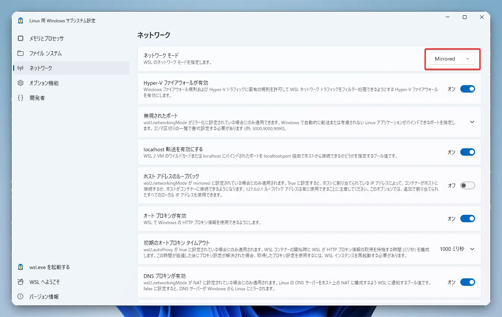
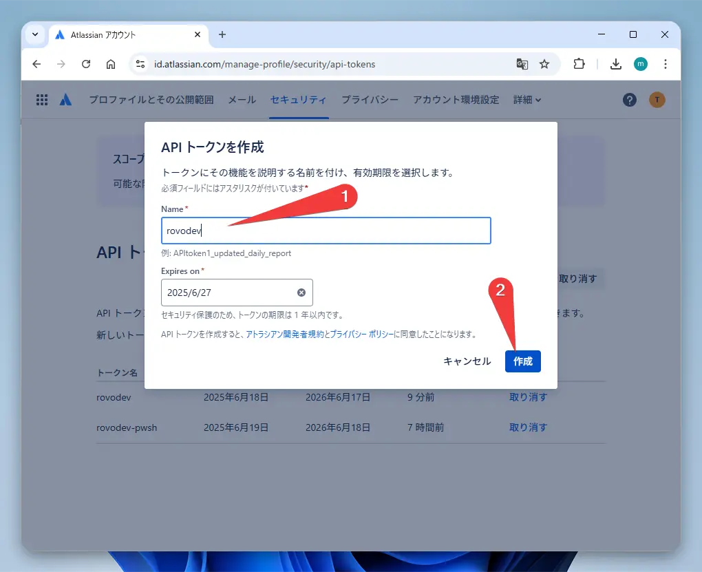

大家好！

顺便说一句，这篇文章也是在 Rovo Dev CLI 的 AI 助手功能帮助下写成的。很方便吧！

这次，我将为大家介绍由 Atlassian 开发的 AI 助手工具“Rovo Dev CLI”。

这是一款类似于热门工具“Claude Code”的工具。你可以在终端上与 AI 对话，让它帮助你编码、创建测试、进行重构等等，用途非常广泛。而且，目前它正处于 Beta 测试阶段，可以免费使用。

不过，在 Windows 的 PowerShell 中直接使用时，日文会出现乱码……

但别担心！
本文将从基本用法讲起，介绍如何使用“WSL2”和“VSCode”完美解决乱码问题，甚至还会介绍如何利用“MCP 联动”功能让 AI 指挥 3D 建模，并附上具体的操作步骤。

### Rovo Dev CLI 是什么？

Rovo Dev CLI 是由开发了 Jira 和 Confluence 的知名公司 Atlassian 开发的一款命令行 AI 助手。

我亲自问了 Rovo Dev 本人“你用的是哪个模型？”，它回答说用的是 Anthropic 公司的 Claude 系列模型。

### Windows 用户请从这里开始！WSL2 的设置

如果你在 Windows 上使用 Rovo Dev CLI，我强烈推荐使用 WSL2 (Windows Subsystem for Linux 2)。
正如刚才所说，这是因为直接在 PowerShell 中使用时，日文会显示为乱码。

#### WSL2 的安装与配置

1.  安装 WSL2

打开“PowerShell”，执行以下命令。

```powershell
wsl --install -d Ubuntu-24.04
```

在我的环境中，需要重启一次电脑才能让 WSL 正常启动。如果你的也无法运行，可以试试这个方法。

2.  WSL2 的初始设置

安装完成后，Ubuntu 会启动，这时请设置你的用户名和密码。

3.  配置便捷的镜像网络模式

设置 WSL2 的新功能“镜像模式”后，Windows 和 WSL2 之间将共享网络，无论在哪一边都可以通过“localhost”访问。
这对于后面要介绍的 MCP 联动功能来说非常方便。

在你的 Windows 用户文件夹（`C:\Users\你的用户名`）中创建一个名为 `.wslconfig` 的文件，并写入以下内容。

```ini
[wsl2]
networkingMode=mirrored
```

你也可以通过菜单中的“WSL Settings”完成同样的操作。



4.  重启 WSL2

为了让设置生效，请在 PowerShell 中执行此命令。

```powershell
wsl --shutdown
```

之后，请再次启动 WSL2（Ubuntu）。

这样，WSL2 的环境就准备好了。
下一步，我们将从 VSCode 连接到这个 WSL2 环境，以便更舒适地进行操作。

### 从 VSCode 连接到 WSL2

接下来的所有操作，我们都将通过 VSCode 的 WSL 扩展来完成。

#### VSCode WSL 扩展的安装与连接步骤

1.  安装 VSCode

如果你还没有安装，请从[官方网站](https://code.visualstudio.com/)下载并安装。

2.  安装 WSL 扩展

启动 VSCode，在左侧的扩展标签页（Ctrl+Shift+X）中搜索“WSL”并安装。

3.  连接到 WSL2

点击 VSCode 窗口左下角的绿色图标，选择“连接到 WSL...”。


4.  选择 Ubuntu-24.04

选择刚才安装的 Ubuntu-24.04。


5.  打开终端

从 VSCode 菜单中选择“终端”→“新建终端”，或者使用快捷键 `` Ctrl+` `` 来打开终端。
像图中那样打开也可以。


现在，从 VSCode 访问 WSL2 的 Ubuntu 的准备工作就完成了！
接下来的操作，我们都在这个 VSCode 内的终端里进行。
编辑和创建文件也可以使用 VSCode 的编辑器，非常方便。

### 安装与初始设置

1.  安装 ACLI (Atlassian CLI)

Rovo Dev 是通过一个名为 ACLI 的 Atlassian 通用工具来使用的。首先，我们把它安装到 WSL2 的 Ubuntu 中。

```bash
# 安装必要的软件包
sudo apt-get install -y wget gnupg2

# 配置 APT 仓库
# 创建用于存放密钥的目录
sudo mkdir -p -m 755 /etc/apt/keyrings
# 下载公钥并转换为 GPG 格式
wget -nv -O- https://acli.atlassian.com/gpg/public-key.asc | sudo gpg --dearmor -o /etc/apt/keyrings/acli-archive-keyring.gpg
# 设置密钥文件的权限
sudo chmod go+r /etc/apt/keyrings/acli-archive-keyring.gpg
# 将仓库信息添加到 APT 配置中
echo "deb [arch=$(dpkg --print-architecture) signed-by=/etc/apt/keyrings/acli-archive-keyring.gpg] https://acli.atlassian.com/linux/deb stable main" | sudo tee /etc/apt/sources.list.d/acli.list > /dev/null

# 安装 ACLI
sudo apt update
sudo apt install -y acli
```

如果你使用其他操作系统，可以参考官网的[Install and update](https://developer.atlassian.com/cloud/acli/guides/install-acli/)页面上的步骤。

2.  获取 Atlassian API 令牌并进行认证

接下来，我们去获取用于登录 Atlassian 账户的 API 令牌。

1.  访问 [Atlassian ID 个人资料](https://id.atlassian.com/manage-profile/security/api-tokens)。
2.  点击“Create API token”，为令牌起一个容易识别的名字（比如 `rovo-dev-cli`），然后创建令牌。


3.  生成的令牌只会显示一次，请务必复制并保存在某个地方！



令牌准备好后，在终端中执行此命令进行认证。

```bash
acli rovodev auth login
```

输入你的电子邮箱地址，然后粘贴刚才复制的 API 令牌，即可完成认证。


3.  启动！

好了，终于要启动 AI 助手了。

```bash
acli rovodev run
```

执行此命令后，终端将切换到与 AI 的对话模式。是不是很激动人心！

### 了解这些会更方便！基本用法

Rovo Dev CLI 提供了许多能让开发工作变得轻松愉快的功能。

#### 自定义提示（自定义指令）

每次都重复提同样的要求，是不是有点麻烦？在这种时候，自定义提示功能就非常方便了。你可以预先告诉 AI一些背景知识。设置方式类似于 Claude 桌面版的 `CLAUDE.md`。

有三种设置方法：

1.  全局配置文件
    在 `~/.rovodev/config.yml` 中像这样写入。这是对整个电脑都有效的指令。

```yaml
additionalSystemPrompt: |
  你是 Python 和 TypeScript 的专家。
  编写代码时，请务必包含测试。
  请用简洁的中文进行说明。
```

2.  全局 Agent 文件
    在 `~/.rovodev/.agent.md` 文件中，写入想让 AI 读取的指令。由于是 Markdown 格式，你可以写得更详细。

```markdown
# 开发者指南

## 编码风格
- 使用 2 个空格进行缩进
- 函数名使用 camelCase
- 类名使用 PascalCase

## 测试方针
- 单元测试是必须的
- 活用 mock 来加速测试
```

3.  项目特定指令
    在你正在工作的仓库根目录下创建一个 `.agent.md` 文件。这对于编写团队共享的规则非常方便。个人设置可以写在 `.agent.local.md` 中，这样可以被 Git 忽略，我非常推荐。

```markdown
# 项目特定指南

本项目是使用 Next.js 和 TypeScript 开发的 Web 应用。

## 架构
- pages/ - 用于路由的页面组件
- components/ - 可复用的 UI 组件
- lib/ - 工具函数和助手函数
- styles/ - CSS 模块和全局样式

## 开发规则
- 组件应使用函数式组件创建
- 状态管理使用 React Hooks
- API 请求使用 SWR
```

所有这些设置都可以组合使用，AI 会综合考虑所有指令来回答你。通过编写有效的自定义指令，你可以从 AI 那里获得更高质量的回答。

#### 命令示例

在对话模式中，你可以这样提问。

*   `summarize this file ./path/to/file.js`: 总结一下这个文件！
*   `add unit tests for UserService`: 为 UserService 编写单元测试！
*   `Refactor this complex function to be more readable`: 把这个复杂的函数重构得更容易阅读！

AI 能够正确理解目录结构，所以只需传递文件路径，它就能理解上下文，这点非常聪明。

#### 对话模式中的实用命令列表

对话模式中还有很多其他方便的命令。它们能让你与 AI 的交流更加顺畅。如果你想了解某个命令的详细用法，可以在对话模式中输入 `/命令名 help`。

#### 会话管理 `/sessions`

管理会话的命令。使用它，你可以将对话历史和上下文分开保存，非常方便。

*   主要功能:
    *   会话管理：可以创建和切换多个对话会话。
    *   上下文保持：每个会话都会记住各自的对话历史。
    *   工作区分离：可以为每个项目分别创建会话。
    *   会话分支：还可以从当前对话中分支出一个新的会话。

重启 Rovo Dev CLI 时，加上 `--restore` 选项，它会自动恢复上一个会话。

#### 清除会话 `/clear`

将当前会话的对话历史全部清除，恢复到初始状态。请注意，此操作无法撤销。如果想保留历史记录，可以使用 `/sessions` 命令创建一个新会话，或者使用接下来介绍的 `/prune` 命令。

#### 优化会话 `/prune`

当对话变得越来越长时，可以使用这个命令。它是一个聪明的命令，能在保留重要内容的同时节省 Token。它会删除 AI 执行的工具（程序）的结果等，从而精简历史记录。

#### 预定义指令模板 `/instructions`

对于像代码审查或文档编写这类常见任务，你可以执行预先准备好的指令模板。

*   内置指令模板:
    *   代码审查与分析
    *   文档生成与改进
    *   单元测试创建与覆盖率提升
    *   总结 Confluence 页面
    *   分析 Jira 问题

你也可以创建自己的自定义模板！

1.  在 `.rovodev/instuctions.yml` 中创建指令文件。
2.  在 `.rovodev` 文件夹中，创建一个 Markdown 文件，写入指令内容。

使用方法很简单，输入 `/instructions` 就会显示模板列表。

#### 内存管理 `/memory`

这是一个让 Rovo Dev CLI 记住有关项目和设置的重要信息的功能。

*   内存类型:
    *   项目内存：保存在当前目录中。（`.agent.md` 和 `.agent.local.md`）
    *   用户内存：全局保存在主目录中。（`~/.rovodev/agent.md`）

内存文件是 Markdown 格式的，可以用来记录项目规则或编码规范等，非常方便。
像 `# 想记录的事情` 这样写，就可以快速添加笔记。

#### 反馈 `/feedback`

用于发送关于 Rovo Dev CLI 的感想或 Bug 报告的命令。

#### 使用情况 `/usage`

可以查看今天 LLM 的 Token 使用量。检查一下有没有用超！

#### 退出 `/exit`

退出应用程序。使用 `/quit` 或 `/q` 效果相同。

### 【高级篇】WSL2 与 Windows 之间的联动

得益于 VSCode 的 WSL 扩展，WSL2 和 Windows 之间的文件共享与应用联动变得非常顺畅。

#### 活用镜像网络模式

我们一开始设置的 WSL2 镜像网络模式，在这里将大显身手。

1.  端口共享：你可以直接从 Windows 的浏览器访问在 WSL2 中启动的服务器（例如 `localhost:3000`）。
2.  网络服务共享：Windows 和 WSL2 都可以使用同一网络上的服务。
3.  与 MCP 服务器的联动：这个功能在接下来要介绍的 MCP 联动中尤为重要。它使得 WSL2 的 Rovo Dev CLI 能够无缝连接到在 Windows 上运行的 Blender 的 MCP 服务器。

 благодаря этой интеграции вы можете получить лучшее из обоих миров: удобный интерфейс Windows и мощную командную строку Linux.
(Note: A Russian sentence was in the original thought process. Translating the intended meaning.)
得益于这种联动，你可以集 Windows 方便的图形界面和 Linux 强大的命令行于一身，取两家之长。

### 【应用篇】用 MCP 让 AI 操作 Blender！

终于到了最后一步！让我们使用 Rovo Dev 的强大功能——MCP (Model Context Protocol)，从 WSL2 控制 Windows 上的 Blender。这次，我们将使用一个名为 [BlenderMCP](https://github.com/ahujasid/blender-mcp) 的便利开源工具。

#### BlenderMCP 是什么？

BlenderMCP 是一个连接 AI 和 Blender 的工具。使用它，AI 就能直接操作 Blender，完成 3D 建模、场景创建、物体操作等任务！

主要功能
- 双向通信：连接 AI 和 Blender
- 物体操作：可以创建、移动、删除物体
- 材质控制：可以上色、设置质感
- 场景检查：AI 可以确认当前 Blender 中的状态
- 代码执行：AI 可以向 Blender 发送并执行 Python 代码

#### 设置步骤

BlenderMCP 由两个部分组成。

1. Windows 端：Blender 插件 (`addon.py`)：安装在 Windows 的 Blender 中
2. WSL2 端：MCP 服务器：安装在 WSL2 的 Ubuntu 中，供 Rovo Dev CLI 使用

那么，我们开始设置吧！

1. Windows 端：安装 Blender 插件
   - 从 [BlenderMCP 的 GitHub 仓库](https://github.com/ahujasid/blender-mcp) 下载 `addon.py` 文件
   - 打开 Blender，进入“编辑”>“偏好设置”>“插件”
   - 点击“从磁盘安装...”，选择下载的 `addon.py` 文件
   - 勾选“Blender MCP”旁边的复选框，启用该插件
   
   

2. WSL2 端：安装 uv 包管理器
   - 在 WSL2 的 Ubuntu 终端中，执行此命令
   ```bash
   # 安装 uv 包管理器
   curl -LsSf https://astral.sh/uv/install.sh | sh
   ```

3. WSL2 端：配置 Rovo Dev CLI
   - 使用 VSCode 编辑配置文件
   ```bash
   export EDITOR="code"
   acli rovodev mcp
   ```
   - 这时 VSCode 会打开配置文件，请添加以下内容。这个设置是为了让 Rovo Dev CLI 启动时自动运行 BlenderMCP。
   ```json
   {
     "mcpServers": {
       "blender": {
         "command": "uvx",
         "args": ["blender-mcp"]
       }
     }
   }
   ```

4. Windows 端：在 Blender 中进行连接设置
   - 在 Blender 界面中，打开 3D 视图的侧边栏（如果未显示，请按 N 键）
   - 找到名为“BlenderMCP”的标签页，点击“Connect to MCP server”
   
   

5. WSL2 端：用 Rovo Dev CLI 操作 Blender！
   - 在 WSL2 的 VSCode 集成终端中执行 `acli rovodev run`
   - 试着向 AI 这样提问：

   ```
   使用 Blender 创建一只猫。
   ```

   结果如何呢？来自 WSL2 的指令，应该会让正在 Windows 上运行的 Blender 画面中出现一个立方体，并向上移动。这就是我们最初设置的镜像网络模式的力量。WSL2 将在 Windows 上运行的 Blender 识别为“localhost 上的服务器”，从而实现了无缝联动。太棒了！

   

#### MCP 故障排除

如果无法正常工作，请检查以下几点：

1.  连接问题：Blender 插件是否已启用？是否在 Blender 的 MCP 标签页中点击了“Connect to MCP server”？
2.  WSL2 镜像网络模式：请确认镜像模式是否已正确启用。
3.  尝试重启：如果连接错误持续出现，最简单的办法可能是重启 Rovo Dev CLI 和 Blender。
4.  命令执行方式：请不要直接执行 `uvx blender-mcp` 命令。Rovo Dev CLI 会根据配置文件自动执行它。

最重要的一点是，确保 WSL2 和 Windows 之间的网络连接已正确设置为镜像模式。

### 总结

本文从 Atlassian 的新款 AI 开发工具“Rovo Dev CLI”的基本用法，到 Windows 用户舒适使用它的 WSL2 活用技巧，再到使用 MCP 进行 Blender 联动，内容广泛地进行了介绍。

虽然一开始的设置可能有些繁琐，但一旦环境搭建完成，那种足不出终端就能获得 AI 强大支持的开发体验，我认为真的是革命性的。

Rovo Dev CLI 目前仍处于 Beta 版，我很期待它未来的发展和进化。
希望这篇文章能帮助大家找到新的开发方式。

请务必尝试一下这款未来的工具。Happy coding! 🎉