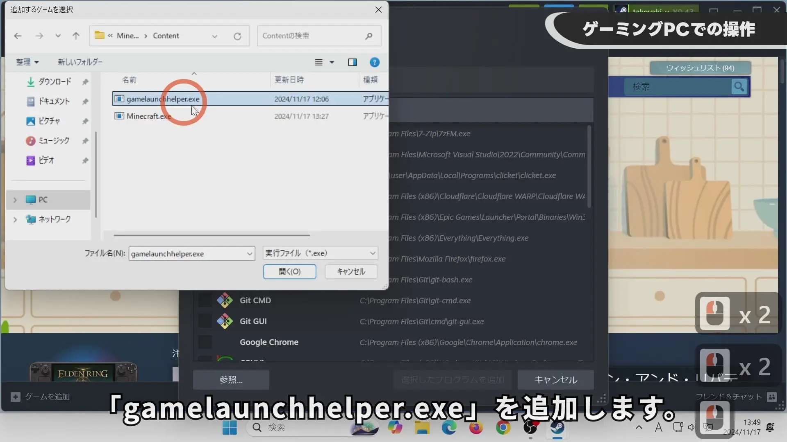
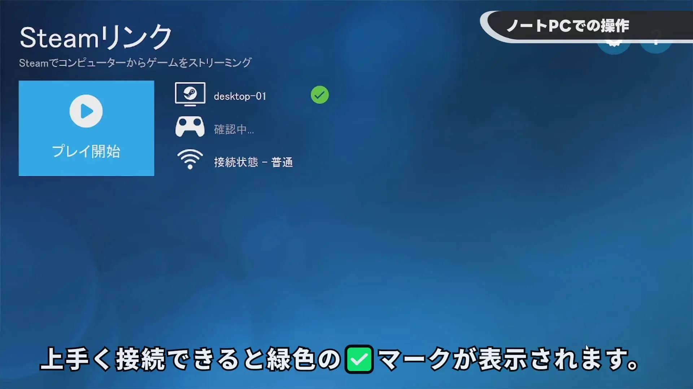
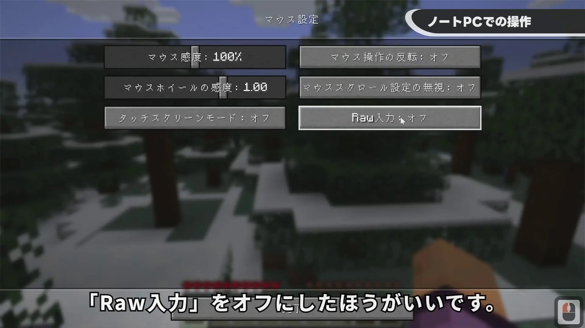

## YouTube Video

Play Minecraft Remotely! Smooth Gameplay on Your Laptop


## Setup on your Laptop (Steam Link Client)

Download Steam Link from the following URL:
https://store.steampowered.com/remoteplay

Download the appropriate Steam Link version for your operating system from the location shown in this image.

Steam Link is compatible with the following operating systems:
- iPhone, iPad, Apple TV (11.0 or later)
- Android (5.0 or later) phones, tablets, and TVs
- Android users without Google Play access
- Raspberry Pi 3, 3+, 4
- Windows
- Linux
- macOS
- Meta Quest 2, 3, Pro

For Windows, it's recommended to use the setup.exe file for installation instead of the msi.  It will also check for any missing software required for your PC environment.

Click "Next" through all the installation prompts.

## Setup on your Gaming PC (Steam Host)

Go to "Steam" -> "Settings" -> "Remote Play" -> and toggle "Enable Remote Play" to ON.

Go to "Games" -> "Add a Non-Steam Game to My Library" -> "Browse" and add the Minecraft Launcher.  In my environment, it's located on the D drive: "D:\XboxGames\Minecraft Launcher\Content\gamelaunchhelper.exe".
After opening, ensure "gamelaunchhelper" is checked and click "Add Selected Programs".

## Remote Play from your Laptop (Steam Link Client)

*Make sure Steam is closed on your laptop.  It will interfere with the connection.*

Launch Steam Link.
Allow access if prompted by the firewall.
You may need to click an OK button on your gaming PC the first time you connect.

The mouse cursor might not appear.  Connecting a spare mouse to the gaming PC can resolve this. Alternatively, if you are using Windows 11 Pro, logging in and out of a remote desktop session can also make the cursor appear.

It's recommended to disable Raw Mouse Input in Minecraft's settings. For some reason, moving the mouse cursor while opening and closing a chest could cause the viewpoint to shift in that direction. Disabling Raw Mouse Input should resolve this issue.
