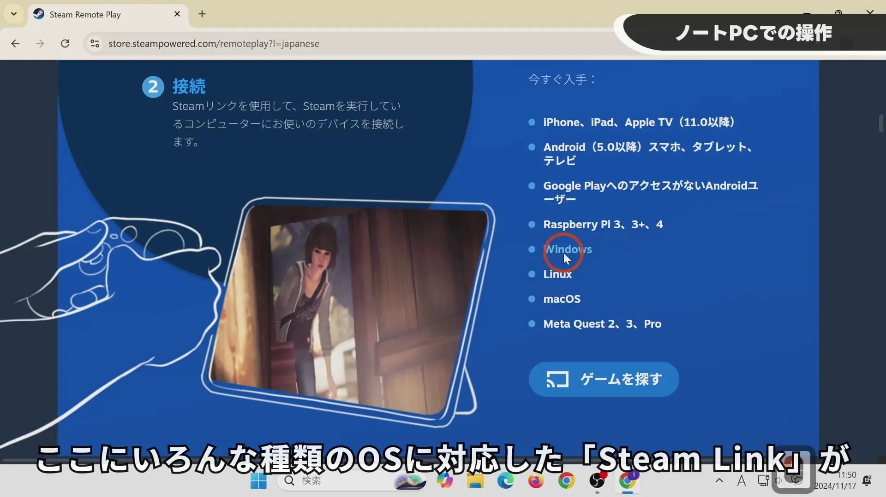
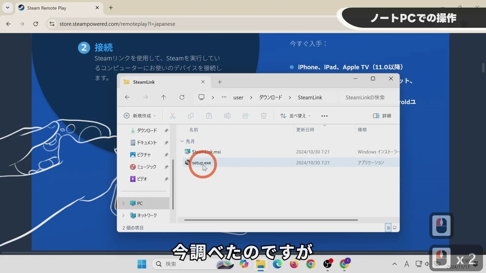
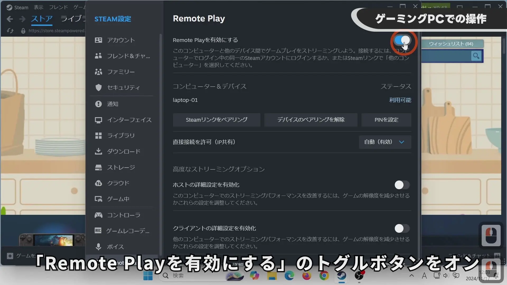

## YouTube動画

【Steam Link】Minecraftをリモートプレイ！ノートPCでも快適プレイ


## ノートPCでの作業（Steam Linkを入れるクライアント側）

次のURLからSteam Linkをダウンロードします。
https://store.steampowered.com/remoteplay

この画像の位置からお手持ちのOSに合ったSteam Linkをダウンロードします。

Steam Linkの対応OSは以下のとおりです。
- iPhone、iPad、Apple TV（11.0以降）
- Android（5.0以降）スマホ、タブレット、テレビ
- Google PlayへのアクセスがないAndroidユーザー
- Raspberry Pi 3、3+、4
- Windows
- Linux
- macOS
- Meta Quest 2、3、Pro

Windowsの場合のインストールは、msiではなくsetup.exeが良いようです。お手持ちのPC環境に足りないソフトのチェックもしてくれるとのことです。

インストールはすべて「Next」にしました。

## ゲーミングPCでの作業（Steamを入れるホスト側）

「Steam」→「設定」→「Remote Play」→「Remote Playを有効にする」のトグルボタンをオンにします。

「ゲーム」→「非Steamゲームをマイライブラリに追加」→「参照」からMinecraftのランチャーを追加します。
私の環境ではDドライブのため「D:\XboxGames\Minecraft Launcher\Content\gamelaunchhelper.exe」にありました。
開いたあと、「gamelaunchhelper」にチェックが入っていることを確認して「選択したプログラムを追加」します。

## ノートPCからリモートプレイ（Steam Linkが入ったクライアント側）

※ノートPC側ではSteamは終了させてください。つながらなくなります。

Steam Linkを起動します。
ファイアウォールの設定が出たら許可をします。
初回はゲーミングPC側でもOKボタンを押す必要があった思います。

マウスカーソルが表示されないことがありました。
ゲーミングPC側に余ったマウスを接続すると表示されます。
また、Windows 11 Proならば、リモートデスクトップのログイン・ログオフをするとマウスカーソルが表示されました。

Minecraftの設定で、マウスのRaw入力をオフにしたほうが良いです。
なぜかチェストを開いてマウスカーソルを動かしチェストを閉じたとき、その方向に視点移動することがありました。マウスのRaw入力のオフでなくなる思います。
