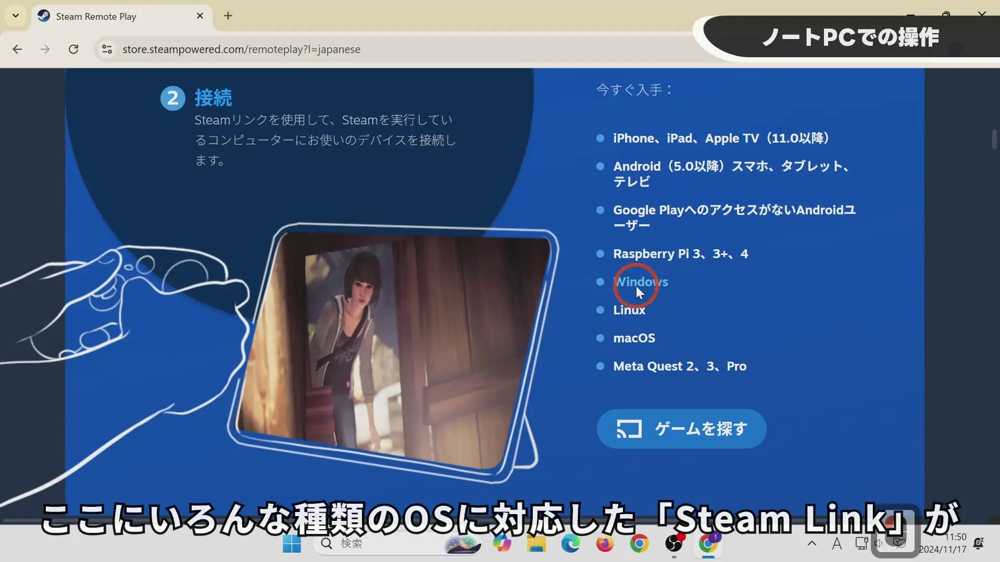
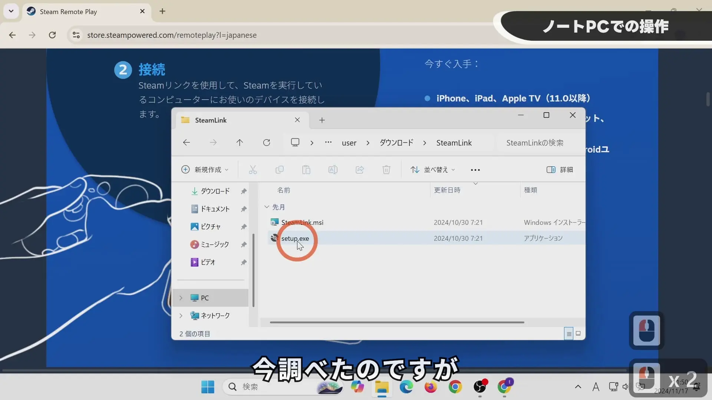
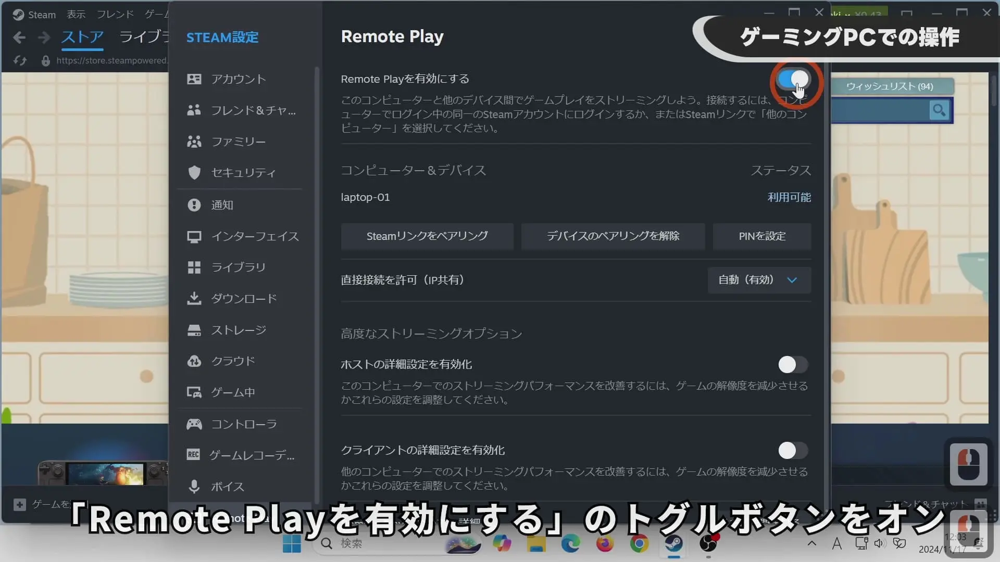
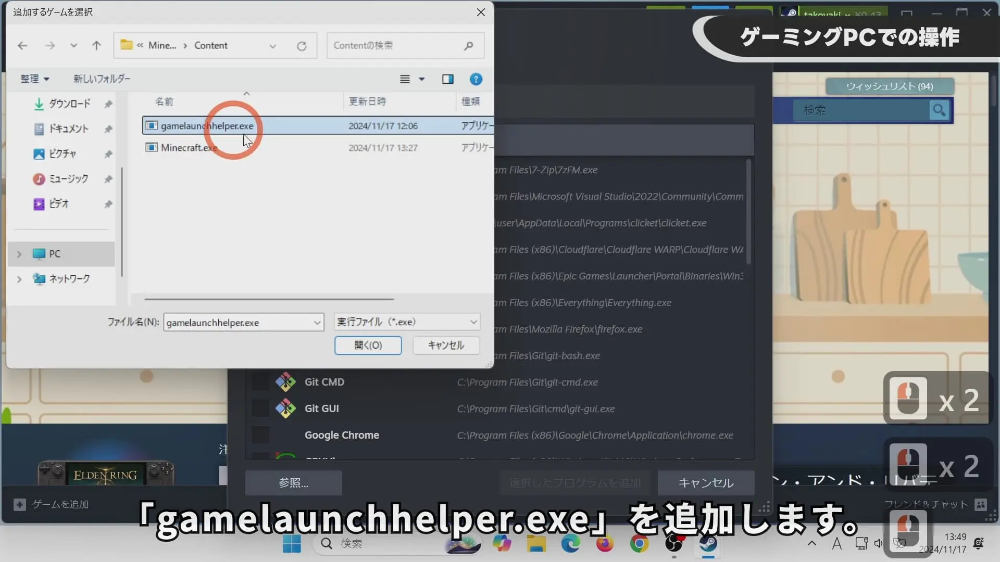
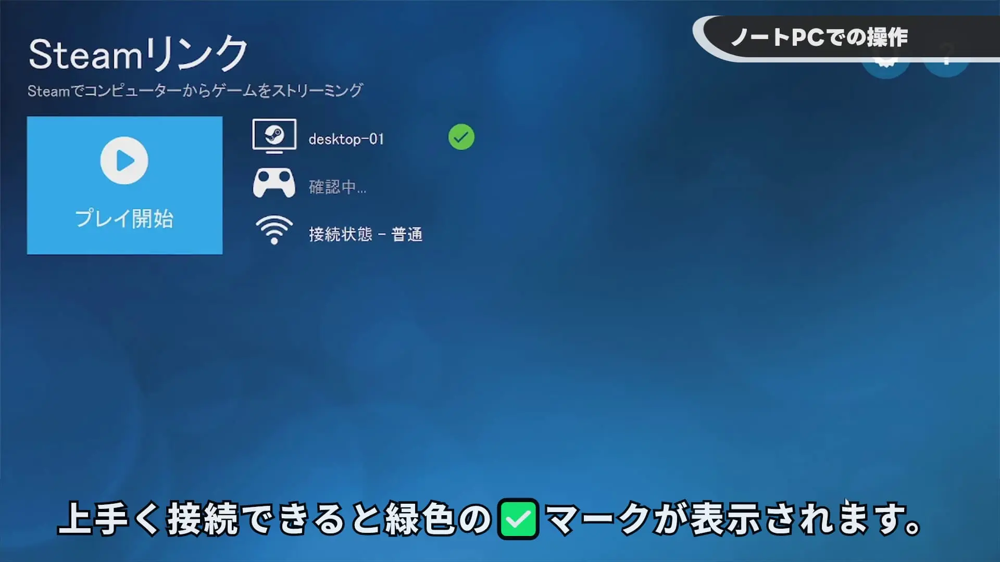
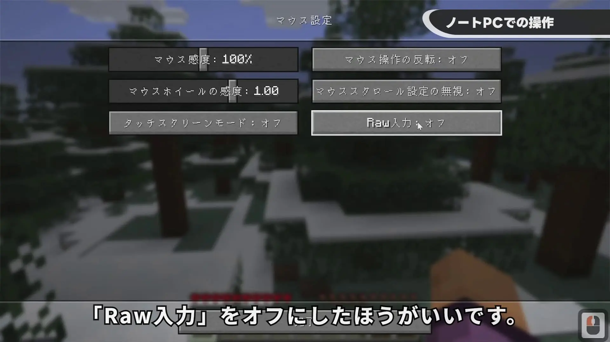

## YouTube 视频

【Steam Link】在笔记本电脑上远程畅玩 Minecraft！


## 在笔记本电脑上进行操作（安装 Steam Link 客户端）

从以下 URL 下载 Steam Link：
https://store.steampowered.com/remoteplay

从此图片所示位置下载适合你操作系统的 Steam Link 版本。

Steam Link 支持以下操作系统：
- iPhone、iPad、Apple TV（11.0 或更高版本）
- Android（5.0 或更高版本）手机、平板电脑和电视
- 无法访问 Google Play 的 Android 用户
- Raspberry Pi 3、3+、4
- Windows
- Linux
- macOS
- Meta Quest 2、3、Pro

对于 Windows 系统，建议使用 setup.exe 文件进行安装，而不是 msi 文件。它还会检查你的电脑环境是否缺少所需的软件。

安装过程中一直点击“下一步”即可。

## 在游戏 PC 上进行操作（安装 Steam 主机端）

点击“Steam” -> “设置” -> “远程畅玩” -> 将“启用远程畅玩”切换为开启状态。

点击“游戏” -> “将非 Steam 游戏添加到库中” -> “浏览”，然后添加 Minecraft 启动器。在我的环境中，它位于 D 盘：“D:\XboxGames\Minecraft Launcher\Content\gamelaunchhelper.exe”。
打开后，确保选中“gamelaunchhelper”，然后点击“添加所选程序”。

## 从笔记本电脑进行远程畅玩（Steam Link 客户端）

*请确保笔记本电脑上的 Steam 已关闭。它会干扰连接。*

启动 Steam Link。
如果防火墙提示，请允许访问。
第一次连接时，你可能需要在游戏 PC 上点击“确定”按钮。

鼠标光标可能不会显示。将备用鼠标连接到游戏 PC 可以解决此问题。或者，如果你使用的是 Windows 11 专业版，登录和注销远程桌面会话也可以使光标显示。

建议在 Minecraft 设置中禁用原始鼠标输入。原因是在打开和关闭箱子时移动鼠标光标可能会导致视角向该方向移动。禁用原始鼠标输入应该可以解决此问题。
